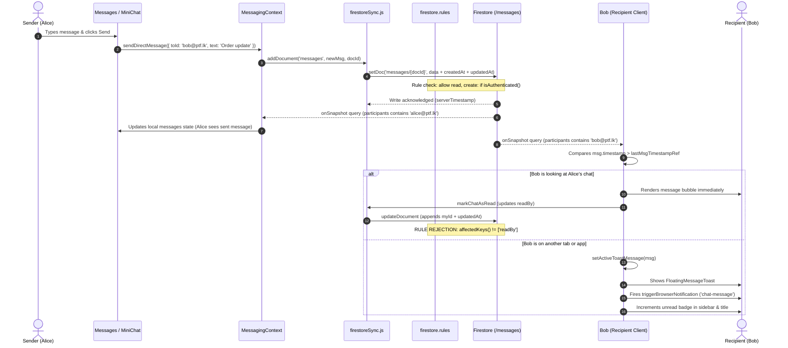

# Internal Messaging Module — Audit Findings & Architectural Review

> **Worktree:** `review-internal-messaging`  
> **Status:** Accepted / Implementation Ready  
> **Date:** 2026-09-20  
> **Scope:** Comprehensive audit of internal messaging implementation, Firestore security rules, real-time synchronization, unread tracking, UI surfaces, and cross-module trigger behaviors.

---

## 1. Executive Summary

The **Internal Messaging** module provides real-time, peer-to-peer 1-on-1 team communication across the Print To Frame ERP platform. The implementation centers around a root `MessagingProvider` (`src/features/messaging/MessagingContext.jsx`) that maintains continuous Firestore snapshot listeners, drives badge updates across desktop and mobile navigation, surfaces floating desktop notifications, and supports two primary UI entry points: a dedicated full-screen master-detail messenger (`src/features/messaging/Messages.jsx`) and an omnipresent floating drawer (`src/features/messaging/MiniChatDrawer.jsx`).

### Key Architectural Strengths
- **Deterministic Virtual Channels:** Conversations avoid dedicated "thread" or "conversation" header documents. Instead, channels are derived dynamically on both client and database levels by sorting and joining sanitized user identifiers (`[user1, user2].sort().join('_')`), eliminating thread creation races.
- **Multi-Surface Reactive Notifications:** Incoming messages trigger synchronized updates across the active conversation pane, sidebar navigation badges, document title badges, floating quick-reply toast popups, and browser `Notification` alerts.
- **Non-Intrusive Quick Reply:** `FloatingMessageToast.jsx` enables users to read and immediately reply to incoming messages from anywhere in the application without leaving their current workflow.

### Critical Vulnerabilities & Disconnects Identified
1. **Critical Data Exposure in Security Rules:** `firestore.rules` allows any authenticated user to read all documents in the `/messages` collection (`allow read: if isAuthenticated();`). While the client SDK filters with `where('participants', 'array-contains', myId)`, any signed-in user (including external customers or partners) can execute unfiltered queries to read confidential internal conversations across all employees and management.
2. **Broken Read-Receipt Rule for Recipients:** `firestore.rules` permits conversation participants to update messages only if `request.resource.data.diff(resource.data).affectedKeys().hasOnly(['readBy'])`. However, `src/services/firestoreSync.js:updateDocument()` unconditionally appends `updatedAt: serverTimestamp()`. Because `affectedKeys()` evaluates to `['readBy', 'updatedAt']`, Firestore rejects all read-receipt writes initiated by recipients in production. Read updates fail silently with caught console warnings.
3. **Keystroke Flooding & Cross-Channel Indicator Leak:** `Messages.jsx` sends a Firestore write to `typing_indicators/{myId}` on every single keystroke without debouncing or throttling. Furthermore, the typing indicator listener subscribes to the entire collection and renders typing banners based on `typingState[activeUser.identifier]` without verifying that `channelId === activeChan`. If User A types a message to User B, User C viewing User A's profile will erroneously see User A typing to them.
4. **RBAC Inconsistencies & Navigation Gating:** While `src/App.jsx` restricts the main `Messages` tab to roles with `canAccess(role, 'messages')`, the floating action button (`MiniChatDrawer`), incoming toasts (`FloatingMessageToast`), and mobile bottom navigation bar do not evaluate permissions. Restricted roles (such as `Partner`, which has `messages: none()`) can open the mini-chat drawer and send/receive direct messages.
5. **Deceptive Read Receipt Representation (`CheckCheck`):** Both `Messages.jsx` and `MiniChatDrawer.jsx` unconditionally display double-checkmarks (`CheckCheck`) on all sent messages, regardless of whether the recipient's identifier exists in `msg.readBy`. Senders are falsely led to believe unread messages have already been seen.
6. **Dead Audio Alert Settings:** The user profile settings view (`UserProfile.jsx`) provides an "Audio Sound Effects" toggle (`audioAlertsEnabled`), but `MessagingContext.jsx` contains no audio playback implementation, Web Audio synthesis, or sound assets.
7. **Unbounded Historical Snapshot Subscriptions:** `MessagingContext.jsx` subscribes to all messages where the current user is a participant without pagination, limits, or date windows. As conversation volume accumulates, memory usage, network egress, and Firestore document reads scale indefinitely on application launch.

---

## 2. Baseline & Codebase Tracing

### 2.1 Component & Service Inventory

| Component / Service | File Path | Primary Responsibility | Audit Status |
|---|---|---|---|
| **Messaging Provider & State** | `src/features/messaging/MessagingContext.jsx` | Global message listener, unread count index, active channel state, actions (`sendDirectMessage`, `markChatAsRead`, `markAllAsRead`) | Verified with critical findings |
| **Full Messages View** | `src/features/messaging/Messages.jsx` | Master-detail chat interface, contact search, typing indicators, communication shortcuts (tel, WhatsApp, email) | Verified with critical findings |
| **Mini-Chat Drawer** | `src/features/messaging/MiniChatDrawer.jsx` | Omnipresent floating button, popover directory, quick 1-on-1 chat panel | Verified with findings |
| **Floating Message Toast** | `src/features/messaging/FloatingMessageToast.jsx` | Ephemeral incoming message toaster with inline reply form and timer auto-dismiss | Verified with findings |
| **App Navigation & Mount** | `src/App.jsx` | Root mount of `MessagingProvider`, sidebar badge (`MessagesNavLink`), mobile navigation bar, browser notification triggers | Verified with findings |
| **Activity Feed Integration** | `src/features/dashboard/NotificationsView.jsx` | Ingests direct messages from `useMessaging()` to populate team communication activity feed | Verified with findings |
| **Firestore Client Sync** | `src/services/firestoreSync.js` | Firestore write helpers (`addDocument`, `updateDocument`, `setDocument`) and collection constants | Verified (Root cause of rule failure) |
| **Security Rules** | `firestore.rules` | Security and access control for `/messages/{messageId}` and `/typing_indicators/{indicatorId}` | Critical vulnerabilities identified |
| **User Profile Settings** | `src/features/profile/UserProfile.jsx` | User preferences UI including dead `audioAlertsEnabled` toggle | Verified with findings |

---

## 3. Codebase Tracing & Verification

### 3.1 State & Context Lifecycle (`src/features/messaging/MessagingContext.jsx`)

1. **Subscription Query & Data Model:**
   - On user login, `MessagingContext` initializes a Firestore query:
     ```javascript
     const q = query(
       collection(db, COLLECTIONS.MESSAGES),
       where('participants', 'array-contains', myId)
     );
     ```
   - Messages are sorted client-side by `(Number(a.timestamp) || 0) - (Number(b.timestamp) || 0)`.
   - **Scale Risk:** The query lacks a `limit()`, `orderBy()`, or date constraint. A user with 10,000 historical messages will download and sort all 10,000 documents every time the application loads.
2. **Incoming Message Detection & Suppressor Logic:**
   - The provider maintains `lastMsgTimestampRef` and `initialLoadDoneRef`. Once the initial snapshot is ingested, subsequent snapshots trigger toast and browser notifications if:
     ```javascript
     const isFromOther = msgFrom !== myId;
     const isUnread = !(msg.readBy || []).map(r => String(r).toLowerCase()).includes(myId);
     const isNewer = (Number(msg.timestamp) || 0) > lastMsgTimestampRef.current;
     ```
   - Notifications are suppressed if the user is currently viewing the chat:
     ```javascript
     const isCurrentlyViewingChat = (activeTab === 'messages' && activeChatContactId === msgFrom) ||
                                    (isMiniChatOpen && miniChatContact?.identifier?.toLowerCase() === msgFrom);
     ```
   - **Background Window Defect:** `isCurrentlyViewingChat` only checks React state variables (`activeTab` and `activeChatContactId`). It does **not** check whether the browser tab or window has focus (`document.visibilityState === 'visible'` and `document.hasFocus()`). If a user leaves the ERP open on the `messages` tab and switches to another application (e.g. CAD, email, or a browser spreadsheet), incoming messages from that contact will **never trigger browser notifications or audio alerts**, causing missed notifications.
3. **Unread Count Derivation & Badge State:**
   - Unread counts are computed via `useMemo` by iterating over `users` and filtering messages for each channel where `fromId === uId` and `readBy` does not include `myId`.
   - `totalUnreadCount` is the sum of all unread counts across all contacts.
   - Dynamic tab title:
     ```javascript
     document.title = totalUnreadCount > 0 ? `(${totalUnreadCount}) ${baseTitle}` : baseTitle;
     ```
4. **Write Performance & Mutation Costs (`markChatAsRead` / `markAllAsRead`):**
   - When marking a conversation or all messages as read, the context loops through unread messages and issues an independent `updateDocument()` call for each document:
     ```javascript
     for (const m of unreadMsgs) {
       updateDocument(COLLECTIONS.MESSAGES, m._firestoreId, {
         readBy: [...readBy, myId]
       }).catch(e => console.warn("Read sync error:", e));
     }
     ```
   - If an active conversation has 50 unread messages, opening the chat fires 50 concurrent Firestore writes instead of using a batched write (`writeBatch(db)`).

### 3.2 Full Messages View (`src/features/messaging/Messages.jsx`)

1. **Contact Directory & Filter Bar:**
   - Filters contacts between `all` teammates and `unread` chats.
   - Displays real-time unread count badges next to contact names.
   - Automatically selects the first contact on mount if none is active.
2. **Typing Indicators — Unchecked Subscription & Privacy Leak:**
   - `Messages.jsx` subscribes to the entire `typing_indicators` collection without a query filter:
     ```javascript
     const typingUnsub = onSnapshot(collection(db, COLLECTIONS.TYPING_INDICATORS), (snap) => {
       const typingData = {};
       snap.forEach(d => {
         const data = d.data();
         if (data.isTyping && Date.now() - data.timestamp < 3000) {
           typingData[data.fromId] = data.channelId;
         }
       });
       setTypingState(typingData);
     });
     ```
   - In the chat header banner (line 385), it renders:
     ```javascript
     {typingState[activeUser.identifier] && (
       <div ...>{activeUser.name} is typing...</div>
     )}
     ```
   - **Bug & Cross-Channel Leak:** The condition evaluates `typingState[activeUser.identifier]`, which is the string `data.channelId`. It **never checks** whether `typingState[activeUser.identifier] === activeChan`! If User A is typing a message to User B, User C (who currently has User A's chat open) will see "{User A} is typing...", leaking presence and conversation activity across channels.
3. **Keystroke Flooding:**
   - In the input `onChange` handler:
     ```javascript
     onChange={(e) => {
       setInputText(e.target.value);
       sendTypingIndicator(e.target.value.length > 0);
     }}
     ```
   - `sendTypingIndicator()` executes `setDocument(COLLECTIONS.TYPING_INDICATORS, myId, ...)` on **every single keystroke**. Without a debounce timer (e.g. 500ms–1000ms), a user typing a paragraph triggers dozens of concurrent Firestore writes.
4. **Broken Reply Action:**
   - `Messages.jsx` defines state `const [replyTo, setReplyTo] = useState(null)`.
   - The UI includes logic to render a quoted reply block (lines 360-364):
     ```javascript
     {msg.replyTo && (
       <div ...>Replying to <strong>{msg.replyTo.senderName}</strong>: {msg.replyTo.text}</div>
     )}
     ```
   - **Dead Code / Missing Interaction:** There is no reply button, hover action, or context menu anywhere in the message list to set `setReplyTo(msg)`. The state is initialized to `null` and only ever reset to `null` on send. Users cannot reply to specific messages from within the full messages screen.
5. **False "Encrypted" Marketing Text:**
   - Empty state text on line 349 states: *"Direct messages are encrypted and synchronized across all devices in real time."*
   - In reality, messages are stored in plaintext JSON in Firestore with open read access in security rules.
6. **Dead Prop:**
   - Component prop `onUnreadCountChange` is declared on line 14 but never called in the component.

### 3.3 Quick Messenger Floating Drawer (`src/features/messaging/MiniChatDrawer.jsx`)

1. **Floating Action Button (FAB) & Unread Badge:**
   - Anchored to the bottom-right corner (`bottom-5 right-5 z-50`).
   - Renders animated bounce badge showing `totalUnreadCount` (or `'99+'`).
2. **Two-Mode Architecture:**
   - **Mode A (Recent Directory):** Searchable list of recent conversations displaying last message snippet, relative timestamp, and contact unread badges.
   - **Mode B (Direct Conversation):** Instant messaging view with active contact avatar, full name, role, scroll-to-bottom on new messages, and automatic read receipt dispatch (`markChatAsRead(resolvedContact.identifier)`).
3. **Feature Discrepancies vs Full View:**
   - **No Typing Indicators:** Does not subscribe to or emit typing indicators.
   - **No Quoted Replies:** Does not support or render `replyTo` metadata.
   - **Silent Failure on Send Error:** When `sendDirectMessage` throws an exception, `handleSend` logs `console.error('Send error:', err)` without showing a toast notification, while clearing `inputText` immediately before awaiting the write. If the write fails, the user's typed message is permanently lost.

### 3.4 Floating Message Toast (`src/features/messaging/FloatingMessageToast.jsx`)

1. **Interaction Flow:**
   - Mounts globally and animates into view when `activeToastMessage` is populated.
   - Includes an auto-dismiss timer of 7 seconds (`setTimeout(() => dismissToast(), 7000)`).
   - Pauses auto-dismissal if the user hovers over the card (`onMouseEnter`) or clicks "Quick Reply" (`showReplyBox === true`).
2. **Quick Reply Schema Inconsistency:**
   - Submitting a quick reply calls:
     ```javascript
     await sendDirectMessage({
       toId: sender.identifier,
       text: quickReplyText.trim(),
       replyTo: activeToastMessage
     });
     ```
   - In `MessagingContext.jsx`, `replyTo` is mapped to:
     ```javascript
     replyTo: {
       id: replyTo._firestoreId || replyTo.id,
       text: replyTo.text,
       fromId: replyTo.fromId
     }
     ```
   - In contrast, `Messages.jsx` expects `replyTo.senderName` when rendering:
     ```javascript
     Replying to <strong>{msg.replyTo.senderName}</strong>: {msg.replyTo.text}
     ```
   - Because `MessagingContext` saves `fromId` and omits `senderName`, replies sent from the toast render with a blank sender name in `Messages.jsx`.

### 3.5 App Navigation & Unread Badges (`src/App.jsx`)

1. **Desktop Sidebar Badge:**
   - `MessagesNavLink` consumes `useMessaging().totalUnreadCount` and passes it to `<NavLink badge={totalUnreadCount} />`.
2. **Mobile Bottom Navigation Disconnects:**
   - In `src/App.jsx` lines 1517-1525:
     ```javascript
     <button
       onClick={() => { setActiveTab('messages'); setMobileMenuOpen(false); }}
       className={`flex-1 py-1 flex flex-col items-center justify-center gap-0.5 rounded-xl transition-all cursor-pointer ${
         activeTab === 'messages' ? 'text-primary font-black' : 'text-on-surface-variant hover:text-on-surface'
       }`}
     >
       <MessageSquare size={18} />
       <span className="text-[10px] font-bold">Messages</span>
     </button>
     ```
   - **Missing Badge:** The mobile bottom bar button does not render an unread count badge, unlike the desktop sidebar and the floating mini-chat drawer.
   - **Missing Access Guard:** The mobile button unconditionally switches to `activeTab = 'messages'` without verifying `canAccess(currentUser?.role, 'messages')`.
3. **Global Mounting without RBAC Checks:**
   - Both `FloatingMessageToast` and `MiniChatDrawer` are rendered unconditionally on lines 1203-1204:
     ```javascript
     <FloatingMessageToast setActiveTab={setActiveTab} />
     <MiniChatDrawer currentUser={currentUser} setActiveTab={setActiveTab} />
     ```
   - They do not check `canAccess(currentUser?.role, 'messages')`. As a result, roles configured with `messages: none()` (such as `Partner`) still have full access to chat via the floating drawer and incoming toasts.

### 3.6 Activity Feed Integration (`src/features/dashboard/NotificationsView.jsx`)

1. **Message Feed Transformation:**
   - `NotificationsView.jsx` ingests `messages` from `useMessaging()` and takes the latest 30 messages (`(messages || []).slice(-30).reverse()`).
   - Senders are resolved against the `users` list to show avatars and names.
2. **Self-Notification Anomaly:**
   - Line 32 maps all messages without checking `msg.fromId !== currentUser?.identifier`.
   - Consequently, messages sent by the current user are rendered in the current user's notification feed as *"Message from [My Name]"*.
3. **Bulk Mark as Read:**
   - Clicking "Mark Messages Read" or "Clear & Mark Read" calls `markAllAsRead()` from `useMessaging()`.

---

## 4. Cross-Module Trigger & Architecture Audit

### 4.1 Real-Time Message Propagation Chain



### 4.2 Security Rules Audit & Data Exposure Analysis

In `firestore.rules` lines 205-216:
```javascript
match /messages/{messageId} {
  allow read, create: if isAuthenticated();
  allow update: if isAdmin()
    || (isAuthenticated() && resource.data.fromId == request.auth.token.email)
    || (isAuthenticated() && request.auth.token.email in resource.data.participants
        && request.resource.data.diff(resource.data).affectedKeys().hasOnly(['readBy']));
  allow delete: if isAdmin() || (
    isAuthenticated() &&
    resource.data.fromId == request.auth.token.email &&
    (request.time.toMillis() - resource.data.timestamp) < 900000
  );
}
```

#### Detailed Vulnerability Breakdown

| Rule Directive | Security Expectation | Actual Rule Behavior | Risk Level |
|---|---|---|---|
| `allow read` | Only conversation participants (`participants`) should read messages. | `if isAuthenticated();` — grants global read access across all documents to any signed-in user. | **CRITICAL** |
| `allow create` | Caller must be the sender (`fromId == token.email`) and be in `participants`. | `if isAuthenticated();` — allows arbitrary payload injection, identity spoofing, and forged timestamps. | **HIGH** |
| `allow update` | Recipient should be able to append their email to `readBy`. | Rejects recipient updates because `updateDocument` adds `updatedAt: serverTimestamp()`, violating `hasOnly(['readBy'])`. | **CRITICAL (Functional Bug)** |
| `allow delete` | Sender may delete within 15 minutes (900,000 ms). | Works as designed, but no UI exists to trigger deletions. | **LOW** |
| `RBAC Integration` | Respect `checkPermission('messages', action)` from settings matrix. | Completely bypassed; `checkPermission` is never called. | **HIGH** |

### 4.3 The Read-Receipt Rule Failure Mechanics

1. When Bob receives a message from Alice, Bob's client calls `markChatAsRead()`:
   ```javascript
   updateDocument(COLLECTIONS.MESSAGES, m._firestoreId, {
     readBy: [...readBy, myId]
   });
   ```
2. `updateDocument` in `src/services/firestoreSync.js` performs:
   ```javascript
   await updateDoc(docRef, {
     ...data,
     updatedAt: serverTimestamp(),
   });
   ```
3. The keys being modified in the write request are `['readBy', 'updatedAt']`.
4. The security rule evaluates:
   ```javascript
   request.resource.data.diff(resource.data).affectedKeys().hasOnly(['readBy'])
   ```
5. `hasOnly(['readBy'])` strictly requires that **no other keys** exist in the diff. Because `updatedAt` is present, the expression evaluates to `false`.
6. Result: Unless Bob has role `Admin` or is the message sender (`fromId`), Firestore throws a `PERMISSION_DENIED` error. Bob's client catches the error with `console.warn("Read sync error:", e)`. The message remains permanently marked unread in the database.

### 4.4 Broadcast vs. Direct Messaging Architecture

- **Schema Limitation:** The messaging schema is designed strictly for 1-on-1 direct conversations:
  - `channelId`: String formed by two user IDs (`id1_id2`).
  - `participants`: Array of exactly two user IDs (`[sender, recipient]`).
  - `fromId`: String sender ID.
  - `toId`: String recipient ID.
  - `readBy`: Array of user IDs who have read the message.
- **Broadcast Gaps:** The system contains no broadcast message schema, channel rooms, announcements, or multi-recipient delivery mechanisms:
  - No `type: 'broadcast' | 'direct'` or `channelType` discriminator.
  - No mechanism to fan out unread tracking to all employees without growing the document size.
  - No role-based or department-based distribution lists.

### 4.5 Optimistic Updates vs. Firestore Synchronization

- **Zero Optimistic State Updates:** Neither `MessagingContext`, `Messages.jsx`, nor `MiniChatDrawer.jsx` perform optimistic updates when sending messages:
  - The sender's local `messages` state is **not updated** when `handleSendMessage` is invoked.
  - Senders must wait for the network round-trip to Firestore, followed by snapshot propagation via `onSnapshot`, before seeing their own sent message bubble.
  - In offline or poor cellular network conditions, the UI provides no visual feedback that a message is pending or sending.
- **Input State Eviction on Network Failure:** In `MiniChatDrawer.jsx`, `setInputText('')` is called before awaiting `sendDirectMessage()`. If the network request fails, the input is already cleared and the typed message is permanently lost.

### 4.6 Audio Alert Implementation Disconnect

- `UserProfile.jsx` line 822 exposes an "Audio Sound Effects" toggle bound to `currentUser.audioAlertsEnabled`.
- Codebase grep confirms that `audioAlertsEnabled` is never referenced in `MessagingContext.jsx`, `Messages.jsx`, `MiniChatDrawer.jsx`, or `FloatingMessageToast.jsx`.
- No audio sound effect (e.g. chime, pop, or web audio ping) plays on incoming messages. The setting is completely decorative.

---

## 5. Security & Access Control Audit

### 5.1 RBAC Matrix vs. Security Rules Disconnect

In `src/context/PermissionsContext.jsx`:
- `Admin`: Full access (`view: true, create: true, edit: true, delete: true, export: true`)
- `Manager`, `Sales`, `Operations`, `Support`, `Accounts`, `Logistics`: Full access (`messages: full()`)
- `Customer`, `Business Client`: Full access (`messages: full()`)
- `Partner`: No access (`messages: none()`)

In `firestore.rules`:
- `/messages/{messageId}`: `allow read, create: if isAuthenticated();` (No role or permission checks).
- `/typing_indicators/{indicatorId}`: `allow read, write: if isAuthenticated();` (No role or permission checks).

### 5.2 Contact Directory Exposure

In `src/App.jsx` lines 686-719:
```javascript
if (currentUser?.isApproved) {
  unsubUsers = onSnapshot(collection(db, COLLECTIONS.USERS), (snapshot) => {
    ...
    setUsers(u);
  });
}
```
All approved users receive the complete `users` collection. In `Messages.jsx`, the contact list is derived directly from `users`:
- External clients logged in with the `Customer` role have `messages: full()`.
- They can see the full internal company roster (all employees, managers, administrators, and other customers) including names, emails, phone numbers, roles, and companies.
- External clients can initiate direct messages to any internal staff member or other customers without an assigned support agent or case intermediary.

---

## 6. Resolved Decisions

> **Status**: All 12 decision points below have been **accepted** by the project owner on 2026-09-20. The recommended approach for each item is now the authoritative implementation target. No further approval is required before coding begins.

| # | Topic / Area | Decision Accepted | Resolution | Files to Change |
|---|---|---|---|---|
| **D-MSG-01** | **Firestore Security Rules — Participant Read Access** | ✅ ACCEPTED | Restrict read access on `/messages/{messageId}` to authenticated conversation participants and administrators: `allow read: if (isAuthenticated() && (request.auth.token.email in resource.data.participants \|\| isAdmin())) && checkPermission('messages', 'view');`. Restrict create to authenticated senders: `allow create: if (isAuthenticated() && request.resource.data.fromId == request.auth.token.email && request.auth.token.email in request.resource.data.participants) && checkPermission('messages', 'create');`. | `firestore.rules` (`match /messages/{messageId}`) |
| **D-MSG-02** | **Read-Receipt Rule Fix for Recipients** | ✅ ACCEPTED | In `firestore.rules`, update the update condition to allow `affectedKeys().hasOnly(['readBy', 'updatedAt'])`. This allows non-admin recipients to persist read receipts when `firestoreSync.updateDocument` appends `updatedAt: serverTimestamp()`. In addition, refactor `markChatAsRead` and `markAllAsRead` in `MessagingContext.jsx` to use Firestore `writeBatch(db)` to commit read status updates atomically rather than issuing N separate network writes. | `firestore.rules` (`match /messages/{messageId}`), `src/features/messaging/MessagingContext.jsx` (`markChatAsRead`, `markAllAsRead`) |
| **D-MSG-03** | **RBAC Gating on Floating Components & Mobile Nav** | ✅ ACCEPTED | Wrap `<FloatingMessageToast />` and `<MiniChatDrawer />` mounts in `src/App.jsx` with `canAccess(currentUser?.role, 'messages') && (...)`. Add the same `canAccess(currentUser?.role, 'messages')` guard to the mobile bottom navigation bar button in `src/App.jsx:1518`, rendering it conditionally or redirecting appropriately. | `src/App.jsx` |
| **D-MSG-04** | **Typing Indicators Debounce & Channel Scoping** | ✅ ACCEPTED | (1) Add an 800ms debounce/throttle timer to `sendTypingIndicator` in `Messages.jsx` so keystrokes do not flood Firestore. (2) In `Messages.jsx:385`, verify that `typingState[activeUser.identifier] === activeChan` before rendering the `is typing...` status bar, preventing cross-channel activity leaks. | `src/features/messaging/Messages.jsx` |
| **D-MSG-05** | **Message History Scalability & Scoped Pagination** | ✅ ACCEPTED | Bound the session-level listener in `MessagingContext.jsx` to recent active messages (e.g. `where('timestamp', '>=', Date.now() - 30 * 24 * 60 * 60 * 1000)` or `limitToLast(200)`), and load older conversation history on-demand when scrolling upwards inside a specific channel in `Messages.jsx`. | `src/features/messaging/MessagingContext.jsx`, `src/features/messaging/Messages.jsx` |
| **D-MSG-06** | **Audio Chime & Background Window Notifications** | ✅ ACCEPTED | (1) Implement a lightweight synthesized Web Audio API chime on incoming messages triggered when `currentUser?.audioAlertsEnabled !== false` and the user is not focused on the incoming chat. (2) In `MessagingContext.jsx`, update the incoming notification suppressor condition to check `document.visibilityState === 'visible' && document.hasFocus()`, ensuring backgrounded tabs properly dispatch desktop browser notifications. | `src/features/messaging/MessagingContext.jsx`, `src/utils/audioAlert.js` (or inline Web Audio synthesizer) |
| **D-MSG-07** | **Optimistic Updates & Input State Recovery** | ✅ ACCEPTED | (1) In `MessagingContext.jsx`, implement optimistic local state appending with a temporary client ID and status (`sending`, `delivered`, `failed`). (2) In `MiniChatDrawer.jsx` and `FloatingMessageToast.jsx`, preserve `inputText` until `sendDirectMessage` successfully resolves, and restore the typed text with a toast notification if the write fails. | `src/features/messaging/MessagingContext.jsx`, `src/features/messaging/MiniChatDrawer.jsx`, `src/features/messaging/FloatingMessageToast.jsx` |
| **D-MSG-08** | **Accurate Delivery & Read Status Icons** | ✅ ACCEPTED | Render a single check (`Check`) for sent messages, and dynamically render double check (`CheckCheck`) in primary brand color only when `msg.readBy?.map(r => r.toLowerCase()).includes(targetId.toLowerCase())`. Apply consistently across both `Messages.jsx` and `MiniChatDrawer.jsx`. | `src/features/messaging/Messages.jsx`, `src/features/messaging/MiniChatDrawer.jsx` |
| **D-MSG-09** | **Quoted Reply Workflow & Schema Standardization** | ✅ ACCEPTED | (1) Add a hover/touch action button (`Reply` icon) to message bubbles in `Messages.jsx` that sets `replyTo` state. (2) Standardize the `replyTo` schema across `MessagingContext.jsx`, `Messages.jsx`, and `FloatingMessageToast.jsx` to `{ id, text, fromId, senderName }` so the quoted sender name renders consistently. | `src/features/messaging/Messages.jsx`, `src/features/messaging/MessagingContext.jsx`, `src/features/messaging/FloatingMessageToast.jsx` |
| **D-MSG-10** | **Contact Directory Privacy Scoping** | ✅ ACCEPTED | In `src/context/PermissionsContext.jsx`, change default permissions for `Customer` and `Business Client` to `messages: none()`, restricting the internal chat module strictly to staff. If client-staff messaging is required in the future, it should be mediated via dedicated ticket/inquiry threads rather than open directory chat. | `src/context/PermissionsContext.jsx` |
| **D-MSG-11** | **Broadcast / Announcement Architectural Boundary** | ✅ ACCEPTED | Reaffirm that the `messages` collection is strictly reserved for 1-on-1 direct staff communication. Multi-recipient broadcasts or company-wide announcements will be architected as a separate future feature (e.g. `/announcements` collection or dedicated feed) to preserve deterministic virtual channel semantics. | None (architectural boundary affirmed) |
| **D-MSG-12** | **Activity Feed Self-Notification Filter & Code Cleanup** | ✅ ACCEPTED | (1) In `NotificationsView.jsx`, filter out the user's own sent messages (`msg.fromId !== currentUser?.identifier`) from the notification activity feed. (2) Remove dead prop `onUnreadCountChange` from `Messages.jsx`. (3) Correct marketing string on empty state in `Messages.jsx` from "encrypted" to "real-time synchronized direct messages". | `src/features/dashboard/NotificationsView.jsx`, `src/features/messaging/Messages.jsx` |

---

## 7. Implementation Checklist

> All items in §6 are **accepted**. The following checklist tracks execution status. Mark `[x]` when a change is committed to `review-internal-messaging` branch.

- [ ] **D-MSG-01** — Update `firestore.rules` for `/messages/{messageId}`: enforce participant read check (`token.email in resource.data.participants || isAdmin()`) and sender create check (`fromId == token.email`).
- [ ] **D-MSG-02** — Update `firestore.rules` update check to allow `affectedKeys().hasOnly(['readBy', 'updatedAt'])`; refactor `markChatAsRead` and `markAllAsRead` in `MessagingContext.jsx` to use `writeBatch(db)`.
- [ ] **D-MSG-03** — Wrap `FloatingMessageToast` and `MiniChatDrawer` in `src/App.jsx` with `canAccess(currentUser?.role, 'messages')`; guard the mobile bottom navigation bar button.
- [ ] **D-MSG-04** — Add 800ms debounce/throttle to `sendTypingIndicator` in `Messages.jsx`; check `typingState[uId] === activeChan` before rendering typing indicator bar.
- [ ] **D-MSG-05** — Add query date/count boundaries to `MessagingContext.jsx` global listener and support on-demand channel history.
- [ ] **D-MSG-06** — Implement Web Audio API chime for incoming messages respecting `audioAlertsEnabled`; fix background tab window visibility check in `MessagingContext.jsx`.
- [ ] **D-MSG-07** — Implement optimistic message updates with delivery status; preserve input text on error in `MiniChatDrawer.jsx`.
- [ ] **D-MSG-08** — Update message checkmark icons to show single check (`Check`) for sent and double check (`CheckCheck`) only when `readBy` includes recipient.
- [ ] **D-MSG-09** — Add reply hover button to `Messages.jsx`; standardize `replyTo` schema to `{ id, text, fromId, senderName }`.
- [ ] **D-MSG-10** — Update `DEFAULT_PERMISSIONS` in `PermissionsContext.jsx` to set `messages: none()` for `Customer` and `Business Client`.
- [ ] **D-MSG-11** — Reaffirm 1-on-1 team chat architecture boundary; document broadcast announcements as future milestone.
- [ ] **D-MSG-12** — Filter current user's sent messages from `NotificationsView.jsx`; remove dead prop `onUnreadCountChange` and fix marketing copy in `Messages.jsx`.
