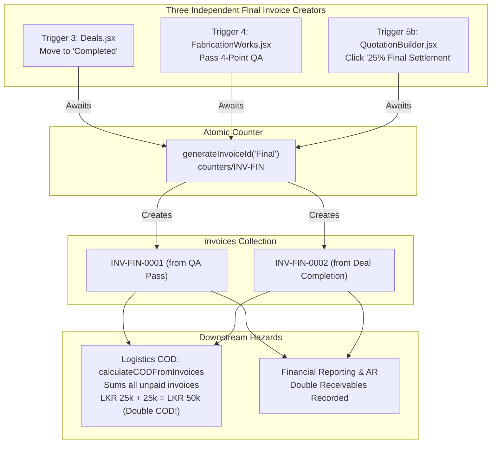

# Invoicing Module Review & Correctness Audit Findings

> **Scope**: Correctness review of `docs/02_modules/invoicing/CLAUDE.md`, `docs/02_modules/invoicing/README.md`, and all cross-module triggers touching Invoicing documented in `docs/01_architecture/CROSS_MODULE_TRIGGERS.md`.  
> **Branch / Worktree**: `review-invoicing` (`.worktrees/review-invoicing`)  
> **Status**: Audit complete — all proposed resolutions ACCEPTED by user (implementation plan locked).

---

## 1. Executive Summary

A comprehensive architectural and trigger audit was conducted across the Invoicing module and its integration boundaries:
- **Module Documentation**: `docs/02_modules/invoicing/README.md`, `docs/02_modules/invoicing/CLAUDE.md`, `docs/01_architecture/CROSS_MODULE_TRIGGERS.md`.
- **Target UI Components**: `src/components/crm/Invoices.jsx`, `src/features/quotations/QuotationBuilder.jsx`, `src/features/leads/LeadCardDetails.jsx`, `src/components/crm/Receipts.jsx`, `src/features/leads/Leads.jsx`, `src/components/crm/Deals.jsx`, `src/components/operations/FabricationWorks.jsx`.
- **Templates & Formatting**: `src/utils/invoiceTemplate.js` (`buildInvoiceHtml`, `openInvoicePrintWindow`), `src/utils/receiptTemplate.js` (`buildReceiptHtml`, `amountToWords`).
- **ID Generation & Atomic Counters**: `src/services/firestoreSync.js` (`generateInvoiceId`, `generateAtomicId`, `deriveReceiptId`), `src/services/auditLog.js` (`logActivity`).
- **Handlers & Hand-offs**: `src/App.jsx` (`handleSaveInvoice`, `handleMarkInvoicePaid`, `handleGenerateReceipt`).
- **Integration Tests & Backend Security**: `tests/integration/invoiceNumbering.test.js`, `firestore.rules` (`invoices`, `counters`, `receipts`, `auditLog` collections).

### Key Discoveries:

1. **Critical Duplicate Final Invoice Generation (Trigger 3 vs 4 vs 5b)**:
   - Up to three distinct workflows independently generate a 25% Final Invoice for the same order/job:
     1. Deal card dragged to "Completed" in `Deals.jsx` (Trigger 3).
     2. 4-point QA pass approved in `FabricationWorks.jsx` (Trigger 4).
     3. "25% Final Settlement" button clicked in `QuotationBuilder.jsx` (Trigger 5b).
   - Neither `Deals.jsx` nor `FabricationWorks.jsx` checks whether a Final invoice already exists for the job/deal/lead before reserving an atomic counter and saving a new document.
   - **Severe Downstream Impact on Logistics COD**: In `src/utils/logisticsEngine.js:L196-L199`, `calculateCODFromInvoices` calculates `totalBalanceDue` by summing **all** unpaid matched invoices (`unpaidInvoices.reduce(...)`). When duplicate 25% Final invoices exist, the delivery driver's screen instructs them to collect **50% of the contract value (2x balance)** from the client on delivery!
2. **Mathematical Compounding Bug in Deal Fallback Line Items**:
   - In `Deals.jsx:L357`, if a deal has no linked quotation, fallback line items are generated with `unitPrice: finalAmount` (where `finalAmount` is already 25% of `deal.value`).
   - In `src/utils/invoiceTemplate.js:L242`, the print renderer calculates line item price as `qty * unitPrice * (isFinal ? 0.25 : 0.75)`.
   - Because `finalAmount` is already 25%, multiplying it by 0.25 again prints the line item at **6.25% (1/16th)** of the deal value, while the summary box below prints the full 25% amount!
3. **Fabrication Final Invoices Lack Quotation and Itemization**:
   - The Final invoice generated in `FabricationWorks.jsx:L721-L747` does not link a `quotationId` or pass any `lineItems`. It relies entirely on a generic fallback row (`Custom steel framing fabrication`), while `advancePaid` and `balanceDue` fields are completely omitted from the payload.
4. **Unconstrained Freeform Invoice Editing & ID Desynchronization**:
   - In `Invoices.jsx:handleEditSubmit`, users can change `amount`, `customerName`, `company`, and `type`.
   - Changing `amount` does not recalculate or validate against the contract value or quotation.
   - Changing `type` (e.g. from "Advance" to "Final") updates the Firestore document field but does **not** alter the immutable document ID (`INV-ADV-####`), resulting in an invoice named `INV-ADV-####` whose type is recorded as "Final Settlement".
5. **Orphaned Receipts & Unchecked Cascading Deletions**:
   - Deleting an invoice via `Invoices.jsx:handleDelete` deletes the `invoices` document but leaves any associated `receipts` intact in Firestore.
   - Furthermore, deleting an invoice that triggered a lead stage change (to "Received") or marked `lead.invoicePaid: true` does not revert the lead stage or partner referral eligibility.
6. **Phantom Lead Properties**:
   - `Leads.jsx` contains multiple conditional checks for `lead.invoiceGenerated` and displays `lead.invoiceDate`. Neither of these fields is ever written or updated by `handleSaveInvoice` or any invoice workflow in the system.
7. **Security Rules / Schema Disconnect for Customer & Partner Portal Access**:
   - `firestore.rules:L151` allows invoice read if `resource.data.customerId == request.auth.token.email` or `resource.data.partnerId == request.auth.token.email`.
   - In practice, `handleSaveInvoice`, `Deals.jsx`, and `FabricationWorks.jsx` never populate `customerId` or `partnerId` with an authentication email. `customerId` is not written at all, and `partnerId` is either omitted or stores internal IDs (e.g., `AG-001`). Thus, the client/partner self-service rule condition is dead code and will deny reads.

---

## 2. Review of Module Documentation

### 2.1 `docs/02_modules/invoicing/CLAUDE.md`

| Section / Claim | Code Status | Details / Discrepancy |
|---|---|---|
| **What it does** ("Invoices are `invoices` documents numbered `INV-ADV-####` / `INV-FIN-####` from a transactional counter. Advance = 75%, Final = 25% of the value.") | **Accurate** | Confirmed: sequential atomic counters `counters/INV-ADV` and `counters/INV-FIN` are used. 75% and 25% splits are used across creators. |
| **Firestore collections it owns or writes** ("Owns `invoices`, `counters`. Writes `receipts`, `leads` (`stage`, `invoicePaid`, `referralStatus`), `auditLog`.") | **Accurate** | Confirmed: writes to `COLLECTIONS.INVOICES`, `COLLECTIONS.COUNTERS`, `COLLECTIONS.RECEIPTS`, `COLLECTIONS.LEADS`, and `COLLECTIONS.AUDIT_LOG`. |
| **Triggers and side effects** ("Marking paid can advance the lead to 'Received', set `invoicePaid`, flag partner referrals Eligible for Payout and emit a commission notification.") | **Accurate** | Confirmed: `handleMarkInvoicePaid` in `src/App.jsx` coordinates lead stage progression, full settlement detection, and session notification emission. |
| **Triggers and side effects** ("No invoice email is sent anywhere.") | **Accurate** | Confirmed: `api/send-email.js` has no calls from any invoicing component or handler. Reminders open WhatsApp via `wa.me`. |
| **Before you edit** ("The 75 / 25 percentages are hardcoded in `QuotationBuilder.jsx`, `Deals.jsx` and `FabricationWorks.jsx`; the edit form lets `amount` change freely.") | **Accurate** | Confirmed: multipliers `0.75` and `0.25` are duplicated across three components, and `Invoices.jsx:handleEditSubmit` allows setting arbitrary `amount`. |
| **Before you edit** ("Always reserve the id with `generateInvoiceId` first; both automatic creators abort the stage change if that fails.") | **Accurate** | Confirmed: both `Deals.jsx` and `FabricationWorks.jsx` await `generateInvoiceId('Final')` and abort state transitions if the promise rejects. |
| **Before you edit** ("One Advance and one Final per lead is a UI convention, not enforced in rules or data.") | **Critical Verification** | Confirmed: rules and backend permit unlimited invoices per lead/job. UI guards only exist in `QuotationBuilder.jsx`; `Deals.jsx` and `FabricationWorks.jsx` do **not** check existing invoices. |

### 2.2 `docs/02_modules/invoicing/README.md`

| Section / Claim | Code Status | Details / Discrepancy |
|---|---|---|
| **Files and Folders** ("`src/components/crm/Invoices.jsx`: list, filters, detail, edit, delete, mark paid, CSV export, WhatsApp reminder, receipt form.") | **Accurate** | Confirmed: all listed functionality exists in `Invoices.jsx`. |
| **Files and Folders** ("`src/utils/invoiceTemplate.js`: printable invoice HTML (`openInvoicePrintWindow`).") | **Accurate** | Confirmed: canonical print renderer shared across views. |
| **Files and Folders** ("`src/services/firestoreSync.js`: `generateAtomicId`, `generateInvoiceId`, `INVOICES` and `COUNTERS` constants.") | **Accurate** | Confirmed: lines 280-335 of `firestoreSync.js`. |
| **Files and Folders** ("`src/App.jsx`: `handleSaveInvoice`, `handleGenerateReceipt`, `handleMarkInvoicePaid`...") | **Accurate** | Confirmed: lines 339-558 of `src/App.jsx`. |
| **Open questions** ("Two automatic Final-invoice creators (deal completion, fabrication QA pass) can both fire for the same job; duplicate guarding between them is not established.") | **Confirmed Hazard** | Deep audit confirms **no deduplication check** exists between Trigger 3, Trigger 4, and Trigger 5b. Multiple Final invoices are created in normal business operations. |
| **Open questions** ("`Invoices.jsx` allows editing `amount` freely, so the 75/25 ratio is a convention, not an invariant.") | **Accurate** | Confirmed: `editForm.amount` can be modified arbitrarily without checking total contract value. |

---

## 3. Codebase Tracing & Component Verification

### 3.1 Target UI Component: `src/components/crm/Invoices.jsx`

#### 1. Archive & Filtering Capabilities:
- Displays summary metric cards: *Total Invoiced*, *Settled Revenue*, *Outstanding Receivables*, *Overdue Exposure*, and *Total Invoices*.
- Filter options: `all`, `paid`, `unpaid`, `overdue`, `advance`, `final`.
- Multi-field search over `customerName`, `company`, and `id`.

#### 2. WhatsApp Payment Reminder:
- `handleSendReminder(inv)` constructs a pre-formatted message and opens `https://wa.me/?text=...`.
- **Hardcoded Banking Details**: The reminder text has hardcoded bank account information:
  ```javascript
  `Bank Transfer Details:\nNation Trust Bank - Head Office (500)\nA/C: 205001028941\nAccount Name: Madhuka Gamage`
  ```
  *Architecture Concern*: Banking details are duplicated between `Invoices.jsx:L86` and `invoiceTemplate.js:L279`. Any company bank account changes require multi-file code updates.

#### 3. Freeform Invoice Editing (`handleEditSubmit`):
- Allows updating `customerName`, `company`, `amount`, and `type`.
- Updates `COLLECTIONS.INVOICES` via `updateDocument`.
- **Anomalies Identified**:
  1. Does not adjust `totalValue`, `advancePaid`, or `balanceDue`.
  2. Does not recalculate or validate `amount` against the parent quotation or deal.
  3. If `type` is changed from "Advance" to "Final", the immutable ID `INV-ADV-####` is preserved, creating a permanent type/identifier mismatch.
  4. Edit capability is exposed to any user with access to the Invoices tab, regardless of specific edit permissions.

#### 4. Deletion Flow (`handleDelete`):
- Calls `deleteDocument(COLLECTIONS.INVOICES, deleteId)`.
- **Cascading & Audit Gaps**:
  1. Orphaned Receipts: Deleting an invoice does **not** delete or mark void the matching receipt in `COLLECTIONS.RECEIPTS`.
  2. Lead State Desynchronization: If an Advance invoice was marked paid, advancing the lead stage to "Received" and setting `invoicePaid: true`, deleting that invoice leaves the lead in its advanced stage with `invoicePaid` still true.
  3. Counter Continuity: Deletion does not touch `counters`. This is good for financial compliance (preventing duplicate reuse), but creates unexplainable gaps in invoice sequences.
  4. RBAC Frontend vs. Backend Mismatch: `firestore.rules:L153` requires `isAdmin()` to delete an invoice. In `Invoices.jsx`, the delete button is rendered unconditionally for all users, leading to permission rejections for non-admin users.

#### 5. Payment Settlement (`handleMarkAsPaid`):
- Updates invoice document with `{ status: 'Paid', paidAt: new Date().toISOString() }`.
- Fires `onMarkPaid(invToUpdate.leadId, docId)` if `invToUpdate.leadId` exists.
- **Defect**: Invoices created from walk-in fabrication jobs without a `leadId` (or where only `dealId` or `jobNo` is populated) cannot notify `onMarkPaid`.

---

### 3.2 Canonical Print Template: `src/utils/invoiceTemplate.js`

- Single canonical HTML builder (`buildInvoiceHtml`) used across Invoices, Lead details, and Logistics.
- **Contract Value & Balance Derivation**:
  ```javascript
  const totalContractValue = Number(inv.totalValue) || 
    (isFinal ? (invoiceAmount > 0 ? invoiceAmount / 0.25 : 0) : (invoiceAmount > 0 ? invoiceAmount / 0.75 : 0));
  const advanceAmount = isFinal ? totalContractValue * 0.75 : invoiceAmount;
  const balanceAmount = isFinal ? invoiceAmount : totalContractValue * 0.25;
  ```

#### Critical Math Compounding Defect:
- Line item total calculation at `L242`:
  ```javascript
  (Number(item.qty || 1) * Number(item.unitPrice || 0) * (isFinal ? 0.25 : 0.75)).toLocaleString(...)
  ```
- This assumes `item.unitPrice` always represents 100% of the item contract value.
- **Bug**: In `Deals.jsx:L357`, fallback line items are generated with `unitPrice: finalAmount` (which is already 25% of `deal.value`).
- When printed, `invoiceTemplate.js` multiplies `finalAmount * 0.25`, rendering line items at **6.25%** of deal value. For a 100,000 LKR deal, the line item shows 6,250 LKR while the grand total box below displays 25,000 LKR.

#### Missing Tax and Discount Computations:
- `QuotationBuilder.jsx:L40-L44` computes line item totals with discounts and taxes:
  `afterDiscount = base * (1 - discountPct / 100); total = afterDiscount * (1 + taxPct / 100)`.
- In `invoiceTemplate.js:L242`, `discountPct` and `taxPct` are completely ignored:
  `item.qty * item.unitPrice * multiplier`.
- If a quotation contains line-item discounts or taxes, the line items rendered on the printed invoice will **not sum** to the invoice total.

---

### 3.3 ID Generation & Atomic Counters (`src/services/firestoreSync.js`)

#### 1. `generateAtomicId(prefix, padLength = 4)`:
- Executes a Firestore transaction against `doc(db, 'counters', prefix)`.
- Increments `value` by 1 and formats with zero-padding: `${prefix}-${String(nextNum).padStart(padLength, '0')}`.
- Concurrency-safe: prevents collisions even when multiple clients generate invoices concurrently.
- Allowed by `firestore.rules`: `match /counters/{counterId} { allow read, write: if isAuthenticated(); }`.

#### 2. `generateInvoiceId(type)`:
- Maps `'Final'` $\rightarrow$ `'INV-FIN'` and `'Advance'` $\rightarrow$ `'INV-ADV'`.
- Produces sequential identifiers: `INV-ADV-0001`, `INV-FIN-0001`.

#### 3. `deriveReceiptId(invoiceId)`:
- Deterministic 1-to-1 string transformation:
  - `INV-ADV-0007` $\rightarrow$ `REC-ADV-0007`
  - `INV-FIN-0002` $\rightarrow$ `REC-FIN-0002`
  - Fallback: `REC-${invoiceId}`
- Ensures receipts never have independent sequence drift from their parent invoice.

---

### 3.4 Integration Handlers: `src/App.jsx`

#### 1. `handleSaveInvoice(invoiceData)`:
- Fallback ID generation: `invoiceData.id || await generateInvoiceId(...)`.
- Auto-assigns standard 7-day payment term:
  `dueDate: invoiceData.dueDate || new Date(Date.now() + 7 * 86400000).toISOString().split('T')[0]`.
- Persists to Firestore via `addDocument(COLLECTIONS.INVOICES, cleanInvoice, docId)`.
- Updates local state optimistically.
- Writes `INVOICE_CREATED` event to `auditLog`.

#### 2. `handleGenerateReceipt(invoice, formData)`:
- Verifies invoice reference exists.
- Memory duplicate guard: `receipts.some(r => r.invoiceId === invoiceId)`.
- Backend transaction guard: `createDocumentIfAbsent(COLLECTIONS.RECEIPTS, receiptId, cleanReceipt)` throws `'ALREADY_EXISTS'` if a duplicate write races through.
- Derives receipt ID via `deriveReceiptId(invoiceId)`.
- Logs `RECEIPT_GENERATED` to `auditLog`.
- Does not modify the invoice record in Firestore.

#### 3. `handleMarkInvoicePaid(leadId, invoiceId)`:
- Idempotent: exits early if `targetInvoice.status === 'Paid'`.
- Sets invoice status to `'Paid'`.
- Resolves sibling invoices using `relatedIds = new Set([leadId, targetLead?.originalLeadId, targetLead?.convertedDealId])`.
- Takes latest Advance and latest Final invoices by `createdAt` (`latestByCreatedAt`).
- Evaluates full settlement:
  `isFullyPaid = Boolean(advanceInvoice) && Boolean(finalInvoice) && paidNow(advanceInvoice) && paidNow(finalInvoice)`.
- **Lead Stage & Settlement Effects**:
  - If `isAdvance && targetLead.stage === '75% Invoice Submitted'`: transitions stage to `'Received'`.
  - If `isFullyPaid`: updates lead with `invoicePaid: true`.
  - If `isFullyPaid && isPartnerReferral && !alreadyEligible`:
    - Updates lead with `referralStatus: 'Eligible for Payout'`.
    - Computes live commission: `commAmount = sqFt * commRate`.
    - Emits session notification: `emitNotification({ type: 'commission', ... })`.

---

### 3.5 Security Rules: `firestore.rules`

```javascript
match /invoices/{invoiceId} {
  allow read: if checkPermission('invoices', 'view') || checkPermission('invoices', 'read') 
    || (isAuthenticated() && resource.data.customerId == request.auth.token.email) 
    || (isAuthenticated() && resource.data.partnerId == request.auth.token.email);
  allow create, update: if checkPermission('invoices', 'create') || checkPermission('invoices', 'edit') || checkPermission('invoices', 'write');
  allow delete: if isAdmin();
}
```

#### Security Vulnerabilities & Mismatches:
1. **Client / Partner Self-Service Disconnect**:
   - The rule grants read permissions if `resource.data.customerId == request.auth.token.email` or `resource.data.partnerId == request.auth.token.email`.
   - In actual code, `handleSaveInvoice`, `Deals.jsx`, and `FabricationWorks.jsx` do **not** write `customerId`.
   - When `partnerId` is written, it contains the internal partner ID (e.g. `AG-004`), **never** the partner's login email address.
   - Consequently, partner/client users cannot view their invoices through this rule condition.
2. **Missing Granular Field Update Restrictions**:
   - Any user with `invoices: edit` or `invoices: write` permission can overwrite any field on an invoice (status, amount, date, lineItems) with no restrictions on immutability of financial records.

---

## 4. Cross-Module Triggers Audit (`CROSS_MODULE_TRIGGERS.md`)



### 4.1 Trigger 3: Deal Reaches Completed (`Deals.jsx`)

* **Trigger**: Deal card moved from "Hand Over" to "Completed" in `Deals.jsx:L281-L410`.
* **Behavior**:
  - Awaits `generateInvoiceId('Final')`. If it fails, aborts stage move.
  - Finds quotation via `(quotations || []).find(q => matchesEntity(q, deal))`.
  - Calculates `finalAmount = deal.value * 0.25`.
  - Emits `onSaveInvoice` with `amount: finalAmount`, `totalValue: deal.value`, `advancePaid: deal.value * 0.75`, `balanceDue: finalAmount`.
* **Gaps**:
  - Does not check if an invoice already exists for this deal.
  - Fallback line items bug multiplies by 0.25 twice in `invoiceTemplate.js`.
  - Uses `.find()` without checking quotation status (`status === 'Accepted'`) or version.

---

### 4.2 Trigger 4: Fabrication Passes QA (`FabricationWorks.jsx`)

* **Trigger**: Operator approves 4-point QA dialog in `FabricationWorks.jsx:L676-L755`.
* **Behavior**:
  - Awaits `generateInvoiceId('Final')`. If it fails, aborts completion.
  - Marks project status as "Completed".
  - Calls `onSaveInvoice` with `amount: targetJob.value * 0.25`, `totalValue: targetJob.value`.
* **Gaps**:
  - Does not check if a Final invoice already exists.
  - Does not link `quotationId`.
  - Does not pass `lineItems`, `advancePaid`, or `balanceDue`.
  - Does not update lead or deal stage.

---

### 4.3 Trigger 3 vs 4 Conflict: Duplicate Final Invoice Generation & COD Inflation

* **Mechanism of Conflict**:
  A deal and a fabrication job represent the exact same customer order. In standard operations:
  1. The workshop finishes fabrication and passes QA $\rightarrow$ **Trigger 4 generates `INV-FIN-0001`**.
  2. The sales/operations coordinator marks the deal as "Completed" in the CRM Kanban $\rightarrow$ **Trigger 3 generates `INV-FIN-0002`**.
  3. If sales also opened `QuotationBuilder` and clicked "25% Final Settlement" $\rightarrow$ **Trigger 5b generates `INV-FIN-0003`**.
* **Direct Financial Impact on Delivery (Driver COD Collection)**:
  - In `src/utils/logisticsEngine.js:L196-L199`:
    ```javascript
    const unpaidInvoices = matched.filter(inv => {
      const status = String(inv.status || 'Unpaid').toLowerCase();
      return status !== 'paid' && status !== 'cancelled' && status !== 'void';
    });
    const totalBalanceDue = unpaidInvoices.reduce((sum, inv) => {
      const val = Number(inv.amount || inv.totalValue || 0);
      return sum + val;
    }, 0);
    ```
  - When both `INV-FIN-0001` and `INV-FIN-0002` exist as Unpaid, `totalBalanceDue` sums both.
  - **Result**: The dispatch rider or driver is instructed to collect **double the remaining balance (50% of contract value instead of 25%)** from the customer at handover!

---

### 4.4 Trigger 5a & 5b: Advance (75%) and Final (25%) from QuotationBuilder

* **Trigger 5a (75% Advance)**:
  - Gated by `if (advanceInvoice || isConvertingAdvance) return;` and `status === 'Accepted'`.
  - Creates `INV-ADV-####` for `grandTotal * 0.75`.
  - Full itemized line items attached.
* **Trigger 5b (25% Final)**:
  - Gated by `if (finalInvoice || isConvertingFinal) return;` and `status === 'Accepted'`.
  - Creates `INV-FIN-####` for `grandTotal * 0.25`.
* **Asymmetry**:
  - `QuotationBuilder.jsx` has button-level guards checking `advanceInvoice` and `finalInvoice` props.
  - Neither `Deals.jsx` nor `FabricationWorks.jsx` implements any corresponding guard.

---

### 4.5 Trigger 5c: Marking Invoice Paid & Lead Progression

* **Implementation**: `src/App.jsx:handleMarkInvoicePaid(leadId, invoiceId)`.
* **Workflow**:
  1. Sets invoice `status: 'Paid'`.
  2. If `type !== 'Final'` (Advance) and lead is in `'75% Invoice Submitted'`, advances lead stage to `'Received'`.
  3. Checks sibling invoices for full settlement (`isFullyPaid = advanceInvoice && finalInvoice && paidNow(both)`).
  4. If `isFullyPaid`:
     - Sets `lead.invoicePaid: true`.
     - For partner referrals, sets `referralStatus: 'Eligible for Payout'` and emits a commission notification.
* **Deficiencies**:
  1. Single Advance without Final: If an order does not require a Final invoice or is paid in full upfront, `isFullyPaid` is never true because `finalInvoice` is null.
  2. Stage Reversal: If an invoice is deleted or edited back to Unpaid, the lead's `'Received'` stage and `invoicePaid: true` are not reverted.
  3. Ephemeral Notification: The commission notification is session-only (`emitNotification`), not persisted in Firestore.

---

### 4.6 Trigger 5d: Receipt Generation Handoff

* **Implementation**: `App.jsx:handleGenerateReceipt`.
* **Workflow**:
  - Triggered on paid invoices only.
  - Derives deterministic receipt ID (`INV-ADV-0001` $\rightarrow$ `REC-ADV-0001`).
  - Guards against duplicates in memory and via Firestore transaction (`createDocumentIfAbsent`).
  - Formats numbers to English words (`amountToWords`) in `receiptTemplate.js`.
* **Gaps**:
  - Invoice document does not record `receiptId` or receipt reference.
  - No support for partial payments or receipt adjustments.

---

## 5. Architectural & Data Consistency Disconnects

| Disconnect Issue | Root Cause | Impact | Recommended Direction |
|---|---|---|---|
| **Duplicate Final Invoices** | Three independent creators (`Deals.jsx`, `FabricationWorks.jsx`, `QuotationBuilder.jsx`) without duplicate existence checks | Redundant `INV-FIN` invoices; doubled COD amounts in Logistics; distorted receivables | Implement centralized deduplication check before generating Final invoices across all three call sites. |
| **Logistics COD Doubling** | `logisticsEngine.js` sums all unpaid matched invoices via `.reduce()` | When duplicate Final invoices exist, driver collects 2x the actual balance from the client | Guard `calculateCODFromInvoices` to only take the single latest unpaid Final invoice. |
| **Line Item Compounding Bug (6.25%)** | `Deals.jsx` sets fallback `unitPrice: finalAmount` (25%), while `invoiceTemplate.js` multiplies by 0.25 again | Line item renders at 6.25% of deal value; table total mismatches invoice total | Set fallback line item `unitPrice` to full `deal.value` (100%), matching quotation line items. |
| **Missing Line Items in Fabrication Invoice** | `FabricationWorks.jsx` does not include `lineItems` in `onSaveInvoice` payload | Printed invoice has no itemized details; displays generic fallback string | Look up linked quotation / deal scope and attach itemized lines. |
| **Taxes & Discounts Ignored in Print** | `invoiceTemplate.js` only computes `qty * unitPrice * multiplier` | Invoices with quotation discounts/taxes print inaccurate line item sums | Incorporate `discountPct` and `taxPct` into `invoiceTemplate.js` line totals. |
| **Freeform Edit Desync** | `Invoices.jsx` allows editing amount/type directly without updating related records or ID prefix | `INV-ADV-####` can have `type: 'Final'`; invoice total deviates from contract value | Lock ID and type after creation; restrict amount adjustments to authorized credit/debit memos. |
| **Orphaned Receipts on Deletion** | `handleDelete` deletes invoice document but leaves `receipts` intact | Stale receipts point to non-existent invoices | Cascade deletion or mark receipts cancelled; restrict deletion to Admin with confirmation. |
| **Phantom Lead Fields** | `Leads.jsx` reads `lead.invoiceGenerated` and `lead.invoiceDate`, which are never written | UI conditions in Leads Kanban either never show or misrepresent state | Stamp `invoiceGenerated: true` and `invoiceDate` in `handleSaveInvoice` or derive dynamically from `invoices` array. |
| **Self-Service Rule Disconnect** | `firestore.rules` expects `resource.data.customerId` and `partnerId` to equal user email | Client and partner users cannot read their invoices | Ensure `handleSaveInvoice` stamps `customerEmail` / `partnerEmail` on invoices. |
| **Hardcoded Bank Details** | Bank account numbers hardcoded in `Invoices.jsx` and `invoiceTemplate.js` | Inconsistent or outdated bank details if account changes | Extract banking details into a shared constant or Firestore config collection. |

---

## 6. Structured Table of Decision Points & User Acceptances

> **Status**: **All proposed resolutions accepted by user.** The resolutions below represent the locked implementation blueprint.

| # | Decision Item | Current Implementation | Accepted Resolution | Implementation Status / Action |
|---|---|---|---|---|
| **D-1** | **Ownership of Final Invoice Generation** | Both `Deals.jsx` (on deal completion) and `FabricationWorks.jsx` (on QA pass) generate a 25% Final invoice. | **ACCEPTED: Option C (Immediate) + Option B (Long-term)**<br/>Add immediate duplicate guard in both components before counter reservation. Standardize on Deals completion as the canonical commercial trigger. | Guard with `invoices.some(inv => (inv.jobNo === jobNo \|\| inv.linkedJobNo === jobNo \|\| inv.dealId === dealId) && (inv.type === 'Final' \|\| inv.id?.includes('INV-FIN')))` prior to calling `generateInvoiceId('Final')`. |
| **D-2** | **Logistics COD Balance Calculation** | `calculateCODFromInvoices` sums all unpaid invoices matching the job, doubling balance if duplicates exist. | **ACCEPTED: Option B**<br/>If multiple Final invoices exist for a job, select only the latest unpaid Final invoice by `createdAt`. | Update `calculateCODFromInvoices` in `src/utils/logisticsEngine.js` so duplicate Final invoices can never double the driver COD balance. |
| **D-3** | **Fallback Line Item Unit Price** | `Deals.jsx` passes `unitPrice: finalAmount` (25%), causing `invoiceTemplate.js` to multiply by 0.25 again (6.25%). | **ACCEPTED: Option A**<br/>Pass `unitPrice: deal.value` (100%) in `Deals.jsx` fallback line items. | Update `Deals.jsx:L357` to set `unitPrice: deal.value || 0`, allowing `invoiceTemplate.js` to scale line items correctly to 25%. |
| **D-4** | **Invoice Editing Policy** | `Invoices.jsx` allows full editing of `amount`, `customerName`, `company`, `type`. | **ACCEPTED: Option B**<br/>Make `id` and `type` strictly immutable; restrict `amount` edits to Admin/Manager roles. | In `Invoices.jsx`, disable `type` dropdown in edit form; validate `amount` changes and restrict edit actions to authorized roles. |
| **D-5** | **Lead Status Tracking (`invoiceGenerated`)** | `Leads.jsx` checks `lead.invoiceGenerated` and `lead.invoiceDate`, which are never written. | **ACCEPTED: Option B**<br/>Eliminate phantom field checks; derive invoice status dynamically from the `invoices` array. | Remove references to `lead.invoiceGenerated` / `lead.invoiceDate` in `Leads.jsx` and evaluate invoice status dynamically using `invoices.filter(...)`. |
| **D-6** | **Receipt Cascade on Invoice Deletion** | Deleting an invoice leaves receipts orphaned. | **ACCEPTED: Option A + C**<br/>Prohibit deleting invoices with existing receipts; implement void/cancellation status instead of hard deletion. | In `Invoices.jsx:handleDelete`, check `receipts.some(r => r.invoiceId === invId)` and block deletion with an explicit warning; support marking invoice `status: 'Cancelled'`. |
| **D-7** | **Single Full-Payment Support** | `handleMarkInvoicePaid` requires BOTH an Advance and Final invoice to exist before flipping `invoicePaid: true`. | **ACCEPTED: Option B**<br/>Add support for 100% full settlement invoices without requiring dummy Advance/Final pairs. | In `src/App.jsx:handleMarkInvoicePaid`, check if a single 100% invoice exists and is paid to flip `invoicePaid: true` on the parent lead. |

---

## 7. Agreed Implementation Blueprint

Following user acceptance of all recommendations, the agreed implementation sequence for the Invoicing module is structured into the following technical action items:

### Phase 1: Duplicate Prevention & COD Protection (P0 - Financial Safety)
1. **Deduplication Guard in `Deals.jsx`**:
   - In `handleMoveForwardInner`, check if a Final invoice already exists for `deal.id` or `deal.jobNo` before calling `generateInvoiceId('Final')`.
   - If an `INV-FIN` invoice already exists, link to the existing invoice ID rather than reserving a new counter and creating a duplicate document.
2. **Deduplication Guard in `FabricationWorks.jsx`**:
   - In `handlePassQAInner`, check if an `INV-FIN` invoice exists for `targetJob.jobNo` or `targetJob.dealId` before calling `generateInvoiceId('Final')`.
   - If one exists, mark project Completed without generating a second invoice.
3. **Logistics COD Engine Fix (`logisticsEngine.js`)**:
   - In `calculateCODFromInvoices`, filter unpaid invoices such that if multiple Final invoices exist for the same job, only the single most recently created one is included in `totalBalanceDue`.

### Phase 2: Pricing & Print Template Consistency (P1 - Accounting Accuracy)
4. **Fallback Line Item Compounding Fix (`Deals.jsx`)**:
   - Update `Deals.jsx:L357` fallback row to pass `unitPrice: deal.value || 0` (100% value) instead of `finalAmount` (25%).
5. **Tax and Discount Rendering (`invoiceTemplate.js`)**:
   - Update `invoiceTemplate.js:L242` to compute item total with discounts and taxes:
     `Number(item.qty || 1) * Number(item.unitPrice || 0) * (1 - Number(item.discountPct || 0)/100) * (1 + Number(item.taxPct || 0)/100) * (isFinal ? 0.25 : 0.75)`.
6. **Fabrication Final Invoice Line Items**:
   - Pass itemized scope or job description line items in `FabricationWorks.jsx:onSaveInvoice` with `totalValue` and contract metadata.

### Phase 3: Financial Integrity & Ledger Safety (P2 - Security & RBAC)
7. **Invoice Immutability in `Invoices.jsx`**:
   - Lock `type` (Advance / Final) to prevent ID prefix desynchronization.
   - Disable editing for non-admin/manager roles.
8. **Receipt Deletion Protection**:
   - In `Invoices.jsx:handleDelete`, check if `receipts.some(r => r.invoiceId === deleteId)`. If true, prevent deletion and advise the user to void/cancel the record instead.
9. **Single Full-Settlement Support in `App.jsx`**:
   - Update `handleMarkInvoicePaid` in `App.jsx` to recognize single full-payment invoices (`type === 'Full'` or `amount === totalValue`) and set `invoicePaid: true` without waiting for a phantom Final invoice.
10. **Clean Up Phantom Lead Properties**:
    - Remove references to `lead.invoiceGenerated` and `lead.invoiceDate` across `Leads.jsx`. Replace with dynamic helpers referencing the `invoices` prop.

