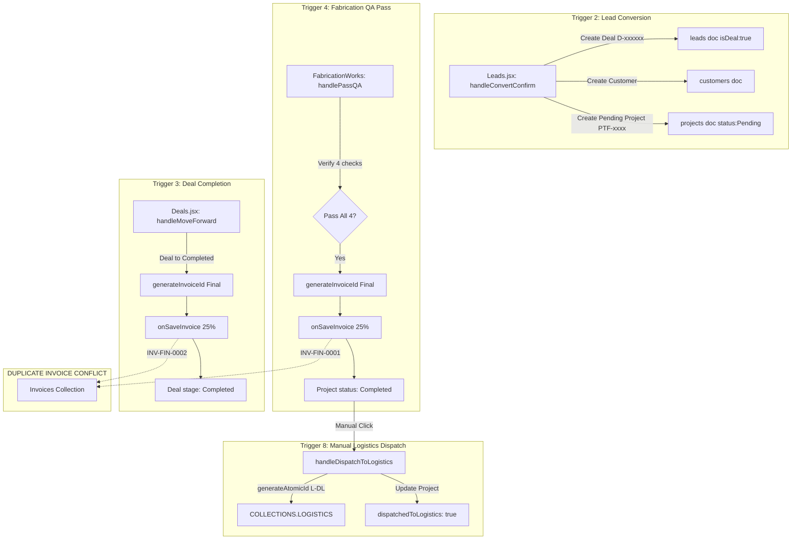

# Operations: Fabrication Module Review & Correctness Audit Findings

> **Scope**: Correctness review of `docs/02_modules/operations-fabrication/CLAUDE.md`, `docs/02_modules/operations-fabrication/README.md`, and all cross-module triggers touching Operations: Fabrication documented in `docs/01_architecture/CROSS_MODULE_TRIGGERS.md`.  
> **Branch / Worktree**: `review-operations-fabrication` (`.worktrees/review-operations-fabrication`)  
> **Status**: Review & Audit complete — **all 11 decision points accepted by product owner on 2026-09-20. Implementation may proceed.**

---

## 1. Executive Summary

A comprehensive architectural and trigger audit was conducted across the Operations: Fabrication module and its integration boundaries:
- **Module Documentation**: `docs/02_modules/operations-fabrication/README.md`, `docs/02_modules/operations-fabrication/CLAUDE.md`, `docs/01_architecture/CROSS_MODULE_TRIGGERS.md`.
- **Target UI Components**: `src/components/operations/FabricationWorks.jsx`, `src/components/operations/FabricationCardDetails.jsx`, `src/components/common/FrameBlueprintPreview.jsx`.
- **Engines & Calculations**: `src/utils/cutListEngine.js` (`calculateCutList`, `mmToFtIn`, `ftToMm`, `STEEL_PROFILES`).
- **Integration Surfaces**: `src/App.jsx` (`projects` collection sync, `handleSaveInvoice`, props contract), `src/features/leads/Leads.jsx` (Trigger 2 lead conversion), `src/components/crm/Deals.jsx` (Trigger 3 completion conflict), `firestore.rules` (`match /projects/{projectId}` permissions), `api/generate.js` (AI update proxy).

### Key Discoveries:

1. **Critical Dual-Invoicing Conflict (Trigger 3 vs Trigger 4 vs Trigger 5b)**:
   - Both `FabricationWorks.jsx` (passing QA gate) and `Deals.jsx` (moving deal to Completed) independently generate a 25% Final Settlement Invoice (`INV-FIN-####`) for the exact same job. Neither component checks if a Final invoice already exists.
   - A third path exists in `QuotationBuilder.jsx` (Trigger 5b manual button).
   - If a fabrication job passes QA and the linked deal is later marked Completed, two separate 25% invoices are generated and posted to accounts receivable.
   - Crucially, `App.jsx` does not pass the `invoices` array to `<FabricationWorks>`, making in-memory deduplication impossible in the current component architecture.

2. **Stage Reversal & Infinite Final Invoice Generation Exploit**:
   - In `FabricationWorks.jsx:L641`, a Completed job can be moved backward to `"Ready For Inspection"` via `handleMoveJobBack`.
   - The UI does not void, cancel, or flag the previously generated Final invoice.
   - When the operator passes the 4-point QA gate again, `handlePassQAInner` reserves a brand-new atomic invoice ID and creates another 25% Final invoice. Cycling a job back and forth generates unbounded duplicate invoices.

3. **Complete Failure of AI WhatsApp Update Feature (`401 Unauthorized`)**:
   - `FabricationWorks.jsx:L813-L817` executes a raw `fetch('/api/generate')` without passing an `Authorization: Bearer <token>` header.
   - The backend proxy endpoint `api/generate.js:L49-L55` strictly enforces authentication via Firebase Admin ID token verification and returns HTTP `401 Missing Authorization bearer token` when headers are absent.
   - Consequently, the "Generate AI WhatsApp Update" button fails 100% of the time in production with "Failed to generate update. Check API connection."

4. **1MB Document Crash Hazard via Base64 Blueprint Attachments**:
   - `FabricationCardDetails.jsx:L126-L148` reads uploaded blueprint images and PDFs as raw base64 data URLs via `FileReader.readAsDataURL()` and attaches them directly to the `blueprints` array on the project object.
   - This entire object is saved directly into the Firestore document via `updateDocument(COLLECTIONS.PROJECTS, ...)`.
   - Firestore enforces a strict 1,048,576 byte (1MB) document size limit. Uploading a single mobile camera photo or architectural PDF will instantly crash Firestore writes with unhandled quota exceptions.

5. **Lead Conversion Dimension Loss & Mathematical Distortion (Trigger 2)**:
   - When a lead is converted to a deal in `Leads.jsx:L572-L600`, the created `projects` document receives `totalSqFt` and `scope`, but `frameWidth`, `frameHeight`, `frameDepth`, `profileKey`, `cutList`, and `checklist` are omitted (`undefined`).
   - When opened in `FabricationCardDetails.jsx:L60-L61`, the modal synthesizes missing dimensions using:
     - `frameWidth = Math.round(Math.sqrt(job.totalSqFt * 144) * 25.4)`
     - `frameHeight = Math.round(Math.sqrt(job.totalSqFt * 144) * 25.4 * 0.67)`
   - This formula forces an arbitrary 1.49:1 aspect ratio that mathematically produces an area of `totalSqFt * 0.67` (only 67% of the contracted square footage), corrupting both the cut-list and the workshop bill of materials.

6. **Manual Job 75% Advance Revenue Blindspot**:
   - When a job is created manually on the shop floor via "New Job Request" in `FabricationWorks.jsx`, the user specifies a contract `value`.
   - No advance invoice is ever generated for manual jobs. When the job passes QA, the system only issues a 25% Final invoice. The remaining 75% of revenue is completely omitted from the invoicing and accounting ledger.

7. **Collision-Prone Non-Atomic Job ID Generation**:
   - Both `Leads.jsx:L488` and `FabricationWorks.jsx:L436` generate job identifiers using `PTF-${String(Date.now()).slice(-4)}`.
   - The 4-digit timestamp slice repeats every 10,000 milliseconds (10 seconds), creating extreme collision risks during concurrent user operations or batch imports.

8. **Dead Security Rules & Customer Isolation Failure**:
   - `firestore.rules:L181` allows read access on `/projects/{projectId}` if `resource.data.customerId == request.auth.token.email`.
   - However, neither `Leads.jsx` nor `FabricationWorks.jsx` populates a `customerId` field on `projects` documents (they use `clientNIC`, `customerNic`, `customerName`, `customerPhone`).
   - As a result, authenticated customers logging in with the `Customer` role are blocked from viewing their fabrication project status via security rules.

---

## 2. Review of Module Documentation

### 2.1 `docs/02_modules/operations-fabrication/CLAUDE.md`

| Section / Claim | Code Status | Details / Discrepancy |
|---|---|---|
| **What it does** ("Fabrication Kanban over `projects` (Pending, Ongoing, Ready For Inspection, Revision, Completed) with a cut-list calculator and a 4-point QA gate.") | **Accurate** | Confirmed: `FabricationWorks.jsx:L44` defines `STAGES = ["Pending", "Ongoing", "Ready For Inspection", "Revision", "Completed"]`. Cut-list calculator in `cutListEngine.js`, 4-point gate in `handlePassQA`. |
| **Firestore collections it owns or writes** ("Owns `projects` (id = job number `PTF-xxxx`). Writes `logistics` (dispatch), `counters`, `invoices` / `auditLog` via `onSaveInvoice`.") | **Accurate (with Nuance)** | Confirmed: Writes `projects`, `logistics`, `counters` (`L-DL`, `Final`), and `invoices` via `onSaveInvoice`. Note: `auditLog` is written by `App.jsx` during `handleSaveInvoice`, not directly by `FabricationWorks.jsx`. Job deletion in `FabricationWorks.jsx` **omits** audit logging. |
| **Triggers and side effects** ("QA pass: reserves a Final invoice id, creates a 25% Final invoice, marks Completed. No deal / lead update.") | **Accurate** | Confirmed: `handlePassQAInner` awaits `generateInvoiceId('Final')`, calls `onSaveInvoice` for 25% of `targetJob.value`, updates project to "Completed". Lead and deal records remain unchanged. |
| **Triggers and side effects** ("Dispatch to Logistics is a manual button.") | **Accurate** | Confirmed: Quick dispatch button appears on Completed cards; creates `COLLECTIONS.LOGISTICS` task and sets `dispatchedToLogistics: true` on project. |
| **Before you edit** ("Possible duplicate Final invoice with `Deals.jsx` completion; no guard between them.") | **Critical Verification** | Confirmed: Both modules independently invoke `onSaveInvoice` with a newly minted `INV-FIN` ID without querying existing invoices. |
| **Before you edit** ("No stock / inventory deduction exists.") | **Accurate** | Confirmed: `cutListEngine.js` calculates bar counts and kerf waste, but there is no inventory collection or deduction logic. |

### 2.2 `docs/02_modules/operations-fabrication/README.md`

| Section / Claim | Code Status | Details / Discrepancy |
|---|---|---|
| **Files and Folders** (`FabricationWorks.jsx`, `FabricationCardDetails.jsx`, `cutListEngine.js`, `FrameBlueprintPreview.jsx`, `App.jsx`) | **Accurate** | All referenced paths exist and correspond to active implementation files. |
| **Firestore collections read/written** ("Reads: `customers` and `partners` props. Does not read `leads` or deals directly.") | **Accurate** | Confirmed: Props received are `projects`, `setProjects`, `customers`, `partners`, `currentUser`, `onSaveInvoice`. `leads`, `deals`, and `invoices` are not passed. |
| **Cloud Functions / triggers** ("Revision forward goes to Ready For Inspection and sets `reworkCompletedAt`.") | **Accurate** | Confirmed in `FabricationWorks.jsx:L590-L607`. |
| **Cloud Functions / triggers** ("At QA pass: if `value > 0` and `onSaveInvoice` exists, a Final invoice id is reserved first... No `quotationId` is set.") | **Accurate** | Confirmed in `FabricationWorks.jsx:L681-L747`. `quotationId` is absent from payload, and `lineItems` array is omitted. |
| **Cloud Functions / triggers** ("Notifications: toasts only. `handleGenerateUpdate` POSTs to `/api/generate` for an AI WhatsApp draft...") | **Broken in Practice** | Confirmed implementation attempt in code, but broken at runtime due to missing `Authorization: Bearer` header required by `api/generate.js`. |
| **Cut list engine** ("constants: 6096 mm stock length, 3 mm saw kerf, 600 mm max span before a stiffener... Stock / inventory deduction: not found.") | **Accurate** | Confirmed in `cutListEngine.js:L53-L55`. |

---

## 3. Cross-Module Triggers Audit (`CROSS_MODULE_TRIGGERS.md`)



---

### Trigger 2: Lead Converts to Deal $\rightarrow$ Fabrication Project Creation

* **Trigger Source**: Lead in stage `"Received"` moved forward, or `"Convert Deal"` modal submitted in `Leads.jsx:L476-L608` (`handleConvertConfirm`).
* **Implementation**: `Leads.jsx:L572-L600`.
* **Trace & Analysis**:
  1. **Payload Sent to `projects`**:
     ```javascript
     const newJob = {
       jobNo: jobNo, // PTF-${Date.now().slice(-4)}
       clientNIC: convertedLead.nic || `AUTO-${Math.floor(...) }`,
       scope: sanitizeTechnicalScope(convertedLead.jobScope) || "Custom steel framing work",
       status: "Pending",
       deadline: convertedLead.date || new Date().toISOString().split('T')[0],
       address: stripEmojis(convertedLead.deliveryLocation) || "Pickup at Colombo Hub",
       materials: "",
       note: "Lead converted via Kanban pipeline.",
       assignee: "",
       flexReceived: false,
       value: convertedLead.value || 0,
       totalSqFt: convertedLead.totalSqFt || 0,
       leadId: convertedLead.id,
       dealId: dealId,
       customerName: convertedLead.name || "",
       customerPhone: convertedLead.phone || "",
       company: convertedLead.company || "",
     };
     ```
  2. **Critical Missing Fabrication Data**:
     - The conversion pipeline does **not** transfer:
       - `frameWidth`, `frameHeight`, `frameDepth`
       - `profileKey` or specific material profile selections
       - Pre-computed `cutList`
       - Initial `checklist` object (`materialsCut`, `frameWelded`, `primerApplied`, `canvasWrapped`, `qaPassed`)
     - Because `checklist` is missing, the card rendered on the Fabrication board displays `0/5 Steps` completed, even if canvas was already in hand.
  3. **ID Collisions**:
     - `jobNo` is generated as `convertedLead.jobNo || 'PTF-' + String(Date.now()).slice(-4)`.
     - Slicing the last 4 digits of `Date.now()` cycles every 10,000 ms (10 seconds).
  4. **Decoupled Lifecycle**:
     - Once created, the `projects` document and the `leads` deal document (`isDeal: true`) diverge completely.
     - Advancing the deal to `"Fabricating"`, `"Ready To Load"`, or `"Hand Over"` in `Deals.jsx` does not advance the project from `"Pending"`.
     - Completing the project in `FabricationWorks.jsx` does not notify or advance the deal.

---

### Trigger 4: Fabrication Passes QA $\rightarrow$ 25% Final Invoice Generation

* **Trigger Source**: Operator passes the 4-point QA dialog on a job in `"Ready For Inspection"` (`FabricationWorks.jsx:L657-L765`).
* **Implementation**: `handlePassQA` $\rightarrow$ `handlePassQAInner`.
* **Trace & Analysis**:
  1. **QA Gate Verification**:
     - Strictly enforces: `qaForm.squareness && qaForm.welds && qaForm.coating && qaForm.canvasTension`.
     - If any check is unchecked, `handlePassQA` aborts with `toast.error('All 4 QA checks must pass before approving — use "Fail & Send to Revision" instead.')`.
  2. **Atomic Counter Reservation**:
     - If `(Number(targetJob.value) || 0) > 0`, awaits `generateInvoiceId('Final')`.
     - If generation fails, aborts stage move to prevent unbilled completions.
  3. **Invoice Payload Structure**:
     ```javascript
     onSaveInvoice({
       id: finalInvId,
       linkedJobNo: targetJob.jobNo,
       jobNo: targetJob.jobNo,
       leadId: targetJob.leadId || '',
       dealId: targetJob.dealId || '',
       originalLeadId: targetJob.originalLeadId || '',
       convertedDealId: targetJob.convertedDealId || '',
       customerName: custName,
       company: cust?.businessName || "",
       phone: targetJob.phone || cust?.phone || "",
       date: now.split("T")[0],
       amount: (Number(targetJob.value) || 0) * 0.25,
       totalValue: Number(targetJob.value) || 0,
       type: 'Final',
       status: 'Unpaid',
       aiDraft: `Final Settlement (25% Balance) upon QA pass of ${targetJob.jobNo} — ${targetJob.scope || 'Custom steel framing'}.`,
       dueDate: new Date(Date.now() + 7 * 86400000).toISOString().split("T")[0],
     });
     ```
  4. **Missing Financial Identifiers**:
     - `quotationId` is omitted (`undefined`).
     - `advancePaid` (75%) and `balanceDue` (25%) are omitted (unlike `Deals.jsx:L350-L351` which populates both).
     - `lineItems` array is omitted (`undefined`).
  5. **Out-of-Order Execution Hazard**:
     - `onSaveInvoice` is invoked **before** `updateDocument(COLLECTIONS.PROJECTS, ...)`.
     - If the network drops or Firestore denies the project update, the invoice has already been written to `COLLECTIONS.INVOICES` and logged to `auditLog`, but the job remains stuck in `"Ready For Inspection"` in Firestore.

---

### Trigger 3 vs Trigger 4 Conflict: Double Final Invoice Generation

* **Conflict Definition**: `Deals.jsx` (Trigger 3) and `FabricationWorks.jsx` (Trigger 4) operate independently on the exact same project lifecycle.
* **Trace & Conflict Mechanics**:
  1. **Dual Invoice Generation**:
     - When fabrication completes: `handlePassQAInner` generates `INV-FIN-0001` for `targetJob.value * 0.25`.
     - When delivery/deal completes: `Deals.jsx:handleMoveForwardInner` generates `INV-FIN-0002` for `deal.value * 0.25`.
     - Both invoices are saved to Firestore, appear in the Invoices ledger, and generate separate `INVOICE_CREATED` audit entries.
     - The customer is billed 50% instead of 25% balance settlement.
  2. **Architectural Blindspot**:
     - `<FabricationWorks>` is mounted in `App.jsx:L1353-L1361` with props: `projects`, `setProjects`, `customers`, `partners`, `currentUser`, `onSaveInvoice`.
     - It does **not** receive `invoices`.
     - Even if `FabricationWorks.jsx` wanted to inspect existing invoices before calling `onSaveInvoice`, it lacks access to the invoice state.
  3. **Stage Reversal Exploit**:
     - In `FabricationWorks.jsx:L641`, `handleMoveJobBack` permits moving a Completed job back to `"Ready For Inspection"`.
     - Neither `projects` nor `invoices` tracks that an invoice was already issued.
     - Re-running QA generates a 3rd, 4th, or Nth Final invoice for the same job.

---

### Trigger 8: Manual Logistics Dispatch Task Creation

* **Trigger Source**: Operator clicks the "Truck" icon on a Completed job card (`FabricationWorks.jsx:L251-L262`, `L522-L567`).
* **Implementation**: `handleDispatchToLogistics(job)`.
* **Trace & Analysis**:
  1. **Atomic Task ID**: Calls `deliveryId = await generateAtomicId('L-DL')`.
  2. **Task Payload**:
     ```javascript
     const logisticsTask = {
       id: deliveryId,
       type: "Delivery",
       subType: "Finished Steel Frame",
       location: job.address || "Colombo Hub Delivery",
       customer: custName,
       status: "Pending",
       manifest: `Delivery of finished fabrication job ${job.jobNo}: ${getFabricationTitle(job)}`,
       driver: "",
       vehicle: "",
       linkedJobNo: job.jobNo,
       createdAt: new Date().toISOString()
     };
     ```
  3. **Project Flagging**:
     - Updates local project state: `{ ...job, dispatchedToLogistics: true, logisticsTaskId: deliveryId }`.
     - Persists update to Firestore: `updateDocument(COLLECTIONS.PROJECTS, ...)`.
     - The truck button is hidden once `dispatchedToLogistics === true`, preventing duplicate dispatches from the UI.
  4. **Asynchronous State Gap**:
     - `FabricationWorks.jsx` does not receive `setLogisticsJobs`.
     - While the Firestore write succeeds and `App.jsx`'s collection listener eventually catches the write, there is no optimistic local addition to the Logistics tab state.
  5. **No Bi-Directional Synchronization**:
     - If the logistics driver completes, reschedules, or cancels the delivery task in `Logistics.jsx`, the project document retains its static `dispatchedToLogistics: true` flag and receives no updates.

---

## 4. Codebase Tracing & Verification

### 4.1 UI Components

#### `FabricationWorks.jsx`
- **Kanban Board**: 5 columns (`Pending`, `Ongoing`, `Ready For Inspection`, `Revision`, `Completed`).
- **QA Inspection Gate**: Gated at `"Ready For Inspection"`. Moving forward opens `ModalWrapper` requiring 4 checks.
- **Revision Flow**: Gated via "Fail & Send to Revision" or quick flag button. Sets `status: "Revision"`, logs `defectDetails` (`category`, `notes`, `reporter`, `reportedAt`). Advancing from Revision returns job to `"Ready For Inspection"` and stamps `reworkCompletedAt`.
- **Role Casing Inconsistency**:
  - In `FabricationWorks.jsx:L358`: `const isAdmin = currentUser?.role === "Admin";` (strict uppercase).
  - In `firestore.rules:L21`: `function isAdmin() { return hasRole('admin') || hasRole('Admin'); }`.
  - A user with role `'admin'` (lowercase) will have admin privileges according to security rules, but the UI will hide delete buttons and admin controls.
- **Silent Deletion Failure & Optimistic Desync**:
  - `handleDeleteConfirm` filters `projects` state optimistically before calling `deleteDocument`.
  - Non-admin users who trigger delete will see the card vanish instantly, followed by a toast error when Firestore rejects the delete. The card reappears only after the next Firestore snapshot.
  - Job deletion emits no entry to `auditLog`.

#### `FabricationCardDetails.jsx`
- **Cut-List Calculation**: Uses `useMemo` calling `calculateCutList` with live dimension state.
- **Aspect Ratio Distortion Bug**:
  - Missing width/height defaults to:
    ```javascript
    frameWidth: job.frameWidth || (job.totalSqFt ? Math.round(Math.sqrt(job.totalSqFt * 144) * 25.4) : 900),
    frameHeight: job.frameHeight || (job.totalSqFt ? Math.round(Math.sqrt(job.totalSqFt * 144) * 25.4 * 0.67) : 600),
    ```
  - Example: For a 100 sq.ft job, `Math.sqrt(14400) = 120 inches = 3048 mm`.
  - Calculated `frameWidth` = 3048 mm (10 ft).
  - Calculated `frameHeight` = `3048 * 0.67` = 2042 mm (6.7 ft).
  - Total area of synthesized frame = $10 \times 6.7 = 67\text{ sq.ft}$, resulting in a **33% loss of contract area** and undersized cut-lists.
- **Base64 Document Size Bloat (1MB Limit)**:
  - `handleFiles` converts attached images/PDFs to Base64 data URLs via `FileReader.readAsDataURL(f)`.
  - When saved, these strings are stored in `job.blueprints` on the Firestore document.
  - Files larger than ~700KB exceed Firestore's 1MB limit post-base64 expansion, causing hard write rejections.
- **Single-Page A4 Workshop Print**:
  - Generates standalone HTML document with QR code, cut list schedule, and signature block.
  - External dependency: Generates QR via `https://api.qrserver.com`. If internet connection is unavailable in the workshop or the third-party service is down, QR code fails to render.

#### `FrameBlueprintPreview.jsx`
- **SVG CAD Visualization**: Illustrative blueprint with isometric depth projection and dimension callouts.
- **Tolerance Contradiction**:
  - Displays `TOLERANCE: ±0.05mm` in the SVG footer (`L197`).
  - `cutListEngine.js:L300` defines `squarenessToleranceMm: 2` (2mm).
  - In structural steel welding, $\pm 0.05\text{mm}$ ($50\,\mu\text{m}$) is a precision CNC milling tolerance; welded box iron operates within $\pm 2\text{mm}$.
- **Structural Disconnect**:
  - Renders a hardcoded X-cross bracing (`Center Tension Bracing Cross`) regardless of the number of intermediate vertical/horizontal stiffener ribs calculated by `cutListEngine.js`.
- **Aspect Ratio Distortion on Extreme Dimensions**:
  - `renderW` is clamped to `Math.max(80, ...)` and `renderH` to `Math.max(60, ...)`.
  - A long banner frame (e.g., 6000mm $\times$ 300mm) will have its height clamped to 60px while width is 320px, distorting the displayed aspect ratio from 20:1 to 5.3:1.

---

### 4.2 Engines & Calculations (`cutListEngine.js`)

1. **Outer Frame Math**:
   - 4 pieces (2 horizontal width $w$, 2 vertical height $h$) with 45° miter cuts on both ends.
   - Diagonal squaring verification target: $D = \sqrt{w^2 + h^2}$.
2. **Intermediate Stiffeners**:
   - `vRibCount = Math.floor(w / 600)`. If remainder $< 150\text{mm}$, decrements by 1.
   - `hRibCount = Math.floor(h / 900)`. If remainder $< 225\text{mm}$, decrements by 1.
   - Stiffener lengths deduct profile wall thickness:
     - `innerHeightMm = h - (profileSize * 2)`
     - `innerWidthMm = w - (profileSize * 2)`
     - Horizontal cross-ties are divided into sub-segments between vertical ribs.
3. **Requisition & Linear Approximation Flaw**:
   - `stockBarsRequired = Math.max(1, Math.ceil((grossLengthMm * 1.05) / 6096))`.
   - This uses a **1D continuous aggregate length approximation** with a 5% waste buffer, rather than a discrete 1D cutting stock bin-packing algorithm.
   - *Failure case*: If a job requires two 4000mm outer members, total length is 8000mm ($+ 5\% = 8400\text{mm}$). The formula calculates $\lceil 8400 / 6096 \rceil = 2$ bars.
   - However, each 4000mm cut leaves a 2096mm offcut. If the frame also requires two 3000mm vertical members, they cannot be cut from the 2096mm offcuts. The true requirement is 4 bars, but the linear formula may calculate 3 bars, causing material shortages on the shop floor.
4. **Profile Width Assumption on Rectangular Tubes**:
   - In `cutListEngine.js:L135`: `const profileSize = profile.widthMm;`.
   - For `rect_1_2` ($25.4\text{mm} \times 50.8\text{mm}$), it always assumes $25.4\text{mm}$, regardless of whether the profile is oriented along its flat edge or narrow edge.
5. **Absence of Inventory Integration**:
   - The engine calculates stock bar requirements, but there is zero linkage to raw material inventory ledgers or purchase orders.

---

### 4.3 Integration Surfaces & Security

#### `App.jsx`
- **Props Contract Deficiency**:
  - `App.jsx:L1353-L1361` mounts `<FabricationWorks>` with `projects`, `setProjects`, `customers`, `partners`, `currentUser`, and `onSaveInvoice`.
  - `invoices` is omitted, preventing any local validation against existing Final invoices.
  - `logisticsJobs` is omitted, preventing local state updates upon dispatch.
  - `deals` is omitted, preventing cross-pipeline status checks.

#### `api/generate.js` & AI Update Breakdown
- `api/generate.js` requires an ID token in the `Authorization` header (`L49-L55`).
- `FabricationWorks.jsx:L813` calls `fetch('/api/generate')` with only `'Content-Type': 'application/json'`.
- Result: AI WhatsApp draft generator is completely inoperative in deployed environments.

#### `firestore.rules` Permissions
- `match /projects/{projectId}` defines:
  ```javascript
  allow read: if checkPermission('projects', 'view') || checkPermission('projects', 'read') || (isAuthenticated() && resource.data.customerId == request.auth.token.email);
  allow create, update: if checkPermission('projects', 'create') || checkPermission('projects', 'edit') || checkPermission('projects', 'write');
  allow delete: if isAdmin();
  ```
- **Flaws**:
  1. `resource.data.customerId == request.auth.token.email` is dead code because `customerId` is never populated on `projects` records.
  2. If an authenticated Client logs into the customer portal, they cannot view their fabrication projects.

---

## 5. Accepted Resolutions

> [!IMPORTANT]
> All 11 decision points below were reviewed and **accepted by the product owner on 2026-09-20**. Implementation may proceed against any of these resolutions without further approval.

| # | Topic / Area | Current Behavior | Risk | Accepted Resolution |
|---|---|---|---|---|
| **F-1** | **Duplicate Final Invoice Prevention** | Both `FabricationWorks.jsx` (QA pass) and `Deals.jsx` (completion) create 25% Final invoices. Neither checks if one already exists. | Customer receives two separate 25% Final Settlement invoices; accounts receivable and revenue figures are artificially inflated. | ✅ **ACCEPTED** — Pass `invoices` prop to `<FabricationWorks>`. In `handlePassQAInner`, check if an invoice with `type === 'Final'` already exists for `targetJob.jobNo`, `targetJob.dealId`, or `targetJob.leadId`. If found, link to it and notify user; do not create a second invoice. |
| **F-2** | **Stage Reversal Invoice Duplication** | Moving a Completed job back to "Ready For Inspection" leaves the Final invoice intact. Passing QA again creates a duplicate invoice. | Unlimited duplicate invoices generated simply by moving a card backward and forward in the Kanban board. | ✅ **ACCEPTED** — Disable backward moves from `"Completed"` stage in `FabricationWorks.jsx` (`onMoveBack = null` when `isLastStage`). Alternatively, prompt a confirmation modal that moving back voids/flags the generated invoice. |
| **F-3** | **Lead Conversion Missing Dimensions** | `Leads.jsx` converts lead to deal and creates `projects` doc with `totalSqFt`, but leaves `frameWidth`, `frameHeight`, `frameDepth`, `cutList`, and `checklist` undefined. | `FabricationCardDetails.jsx` synthesizes fallback dimensions that reduce frame area to 67% of contract square footage, distorting cut-lists. | ✅ **ACCEPTED** — Update `Leads.jsx:handleConvertConfirm` to copy `frameWidth`, `frameHeight`, `frameDepth`, `profileKey` from the lead or accepted quotation, run `calculateCutList`, and initialize a complete `checklist` object. |
| **F-4** | **Manual Job 75% Advance Revenue Omission** | Manually created shop floor jobs have a `value`, but only a 25% Final invoice is generated on completion. No 75% advance invoice is ever created. | 75% of the contract value of walk-in/shop floor jobs is never invoiced or collected in the ERP ledger. | ✅ **ACCEPTED** — When creating a manual job with `value > 0`, offer an option to generate an Advance (75%) invoice immediately, OR clarify whether shop-floor manual jobs represent internal non-billable production orders. |
| **F-5** | **AI WhatsApp Proxy Authentication** | `FabricationWorks.jsx` calls `/api/generate` without `Authorization: Bearer` header, failing with HTTP 401. | "Generate AI WhatsApp Update" feature is completely broken in production. | ✅ **ACCEPTED** — Route the call through `callGeminiProxy` in `src/services/gemini.js` (which attaches `await auth.currentUser.getIdToken()`), or attach the token directly before fetching `/api/generate`. |
| **F-6** | **Blueprint Base64 Storage & 1MB Crash** | Blueprint files (images/PDFs) are converted to Base64 data URLs and stored directly in the Firestore project document. | Uploading standard job photos or PDFs exceeds Firestore's 1MB limit, crashing project updates with unhandled errors. | ✅ **ACCEPTED** — Upload files to Firebase Storage (`/blueprints/{jobNo}/{fileName}`) and store only the resulting download URLs in Firestore. Enforce a client-side file size cap (< 500KB total) as a temporary safeguard until migration is complete. |
| **F-7** | **Non-Atomic Job ID Generation** | Job numbers are generated as `PTF-${String(Date.now()).slice(-4)}` in both `Leads.jsx` and `FabricationWorks.jsx`. | Collisions occur whenever jobs are converted or created within 10 seconds of each other. | ✅ **ACCEPTED** — Use atomic sequential numbering via `generateAtomicId('PTF')` backed by the Firestore `counters` collection and transactions, matching the pattern used for `L-DL` and invoices. |
| **F-8** | **RBAC Role Casing & Delete Audit Logging** | `FabricationWorks.jsx` checks `role === "Admin"` (uppercase only), while Firestore rules accept `'admin'` or `'Admin'`. Project deletion omits `auditLog`. | Lowercase admin users cannot delete jobs in UI; job deletions leave no audit trail in `auditLog`. | ✅ **ACCEPTED** — Use case-insensitive role check: `currentUser?.role?.toLowerCase() === "admin"`. In `handleDeleteConfirm`, add `logActivity(..., 'PROJECT_DELETED', 'Fabrication', ...)`. |
| **F-9** | **Customer Portal Security Rule Alignment** | `firestore.rules` checks `resource.data.customerId == request.auth.token.email`, but `customerId` is never populated on `projects`. | Authenticated clients cannot view their fabrication status in the client portal. | ✅ **ACCEPTED** — Update `Leads.jsx` and `FabricationWorks.jsx` to write `customerId: customerEmail || customerNic` on project creation, and align security rules to match on either `customerId` or `customerNic`. |
| **F-10** | **Cut-List 1D Stock Optimization vs Linear Approx** | `cutListEngine.js` uses linear continuous length + 5% waste factor instead of discrete 1D cutting stock bin-packing. | Can underestimate required 20ft stock bars when multiple large pieces leave offcuts that cannot accommodate subsequent cuts. | ✅ **ACCEPTED** — Implement a greedy First-Fit Decreasing (FFD) 1D bin-packing algorithm for 6096mm stock bars to calculate exact bar requisitions and true shop-floor scrap percentages. |
| **F-11** | **Frame Blueprint SVG Accuracy & Tolerance** | SVG blueprint renders a static X-brace instead of calculated stiffener ribs, and displays `±0.05mm` tolerance instead of `±2mm`. | Visual discrepancy between cut-list specification and CAD preview; unrealistic engineering tolerance on ticket. | ✅ **ACCEPTED** — Update `FrameBlueprintPreview.jsx` to dynamically render `vRibCount` and `hRibCount` lines matching `cutList`, and correct tolerance text to `±2.0mm (Structural Steel)`. |
