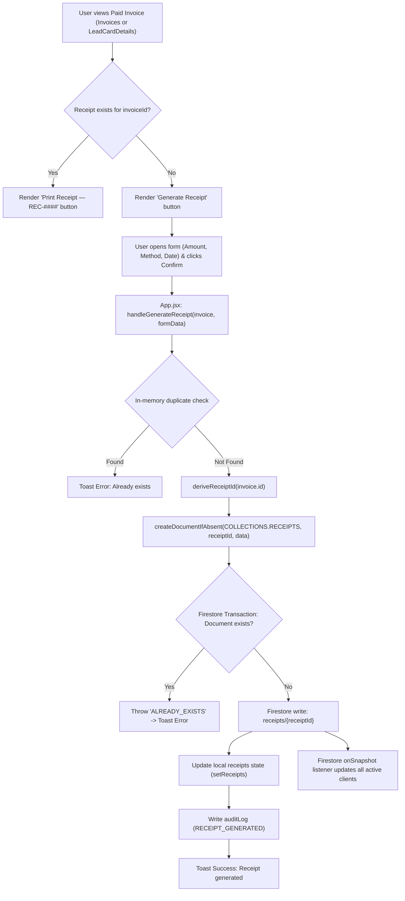

# Receipts Module — Audit Findings & Architectural Review

> **Worktree:** `review-receipts`  
> **Status:** Approved / Decided  
> **Date:** 2026-09-20  
> **Decisions:** All Proposed Option A adopted (Option A+B for DP-REC-06)  
> **Scope:** Systematic review of `receipts` module implementation, cross-module triggers, deduplication, security rules, and data consistency.

---

## 1. Executive Summary

The **Receipts** module acts as an immutable proof-of-payment recording and presentation ledger issued against settled invoices. Key architectural attributes include:
- **Strict 1:1 Invoice Coupling:** Receipt IDs are deterministically derived from invoice IDs (`INV-ADV-0007` $\rightarrow$ `REC-ADV-0007`) rather than independent sequential counters, eliminating sequence desynchronization.
- **Robust Concurrency Deduplication:** Generation is protected across three layers: UI state check, handler pre-check, and an atomic Firestore transaction (`createDocumentIfAbsent`) that rejects duplicate creations with `ALREADY_EXISTS`.
- **Zero Downstream Feedback:** Generating a receipt does not alter invoice status (which must already be `Paid`), lead/deal stages, or ledger balances.

However, the audit revealed several architectural disconnects, security gaps, and design ambiguities:
1. **Unenforced Partial Payment Tracking:** The generation UI allows input of arbitrary payment amounts, but the system cannot record subsequent split receipts or reconcile unpaid balances.
2. **Multi-Tenant / Customer Data Leakage in Security Rules:** `firestore.rules` grants global read access to roles with `checkPermission('receipts', 'view')` (which includes `Customer` and `Business Client` in default presets), exposing all receipts across clients. The customer/partner self-ownership clauses are non-functional because `cleanReceipt` does not persist `customerId` or partner email.
3. **Unchecked UI Deletion vs. Rule Enforcement:** The Receipts UI displays a deletion trigger to all viewers without verifying delete permissions, while `firestore.rules` restricts deletions strictly to `Admin`, causing unexpected runtime failures for Managers and non-admins.
4. **Unhandled Exceptions in CSV Export:** Empty filtered receipt lists cause unhandled runtime exceptions when exporting to CSV.

---

## 2. Baseline & Codebase Tracing

### 2.1 Component & Service Inventory

| Component / Service | File Path | Primary Responsibility | Audit Status |
|---|---|---|---|
| **Receipts Ledger UI** | `src/components/crm/Receipts.jsx` | List, search, filter, detail view, browser print, CSV export, delete modal | Verified with findings |
| **Receipt Print Template** | `src/utils/receiptTemplate.js` | HTML generation for print view, English numeral-to-words converter (`amountToWords`) | Verified with findings |
| **Sync & ID Derivation** | `src/services/firestoreSync.js` | `deriveReceiptId`, `createDocumentIfAbsent`, collections mapping | Verified (Solid design) |
| **Audit Service** | `src/services/auditLog.js` | Logs `RECEIPT_GENERATED` and `RECEIPT_DELETED` actions | Verified with minor discrepancy |
| **Central Handler** | `src/App.jsx` | `handleGenerateReceipt`, real-time listener subscription, state propagation | Verified with findings |
| **Security Rules** | `firestore.rules` | Access control for `/receipts/{receiptId}` | Critical disconnects identified |
| **Originating UI Surfaces** | `src/components/crm/Invoices.jsx`<br/>`src/components/crm/LeadCardDetails.jsx` | Pre-checks and inline generation forms | Verified with findings |

---

## 3. Codebase Tracing & Verification

### 3.1 Receipts Ledger UI (`src/components/crm/Receipts.jsx`)

1. **Status Badge Representation:**
   - The UI unconditionally renders `<StatusBadge status="Paid" size="xs" />` on both list items and the detail pane header.
   - Receipts in Firestore do not possess a `status` property in their data schema. As completed settlement records, they are conceptually immutable and considered "Paid" upon issuance.
2. **Search and Filtering:**
   - Filters support `all`, `advance` (`type === 'Advance'`), and `final` (`type === 'Final'`).
   - Search evaluates `customerName`, `company`, `id`, and `invoiceId`.
3. **Metric Calculations:**
   - Top-level metrics compute `Total Received`, `Advance Receipts`, `Final Receipts`, and `Total Receipts` over the entire `receipts` prop array, while `filteredReceipts` handles the list view.
4. **CSV Export Exception:**
   - `handleExportCsv` invokes `exportToCsv(filteredReceipts, exportColumns, 'Receipts_Export')`.
   - In `src/utils/csvExport.js`, `if (!data || !data.length) throw new Error('No data available to export.')`.
   - If a filter yields zero results, clicking "Export CSV" throws an unhandled error because `handleExportCsv` lacks a guard or try/catch.
5. **Delete Button Visibility & Permissions:**
   - The trash button (`Trash2`) is displayed unconditionally for any selected receipt.
   - The component does not check `canAccess(currentUser?.role, 'receipts', 'delete')` or verify admin status. Non-admin users who click this button will encounter a raw Firestore permission rejection toast.
6. **Audit Log Name Fallback:**
   - When deleting a receipt, `Receipts.jsx` logs `currentUser?.name || 'Unknown'`. In contrast, `App.jsx` constructs `${currentUser.firstName} ${currentUser.lastName}`. If the user object lacks a top-level `.name`, deletions are attributed to `"Unknown"`.

### 3.2 Canonical Print Template (`src/utils/receiptTemplate.js`)

1. **Numeral-to-Words Conversion (`amountToWords`):**
   - Correctly handles integer chunks up to Billions, formatting cents as `XX/100` (e.g., `22526.53` $\rightarrow$ `"Twenty Two Thousand Five Hundred Twenty Six and 53/100 Rupees"`).
   - Suitable for commercial framing project orders.
2. **Print Template Design:**
   - Deliberately strips pre-payment messaging (bank account details, COD instructions, quotation terms).
   - Embeds clean metadata: "Against Invoice", "PAYMENT RECEIVED" badge, derived Receipt No, Date, "Received From", amount box, and a single signature line ("Received By (Print To Frame)").
   - Asset validation: The logo path `/logo-light.png` successfully resolves to `public/logo-light.png`.
3. **Discrepancies:**
   - **Dead Notes Row:** Line 239 conditionally prints `${r.notes ? ... : ''}`. However, neither `Invoices.jsx` nor `LeadCardDetails.jsx` includes a `notes` field in their receipt creation forms. Thus, `r.notes` is always empty in standard workflows.
   - **Missing Client Contact Details:** Invoices render billing addresses, phone numbers, and job scopes; receipts only receive `customerName` and `company`.

### 3.3 Services & Deduplication (`src/services/firestoreSync.js`)

1. **ID Derivation (`deriveReceiptId`):**
   - Maps `INV-ADV-####` $\rightarrow$ `REC-ADV-####` and `INV-FIN-####` $\rightarrow$ `REC-FIN-####`.
   - Fallback `REC-${invoiceId}` handles legacy or ad-hoc IDs.
   - **Architecture Rationale:** Tying the receipt ID directly to the invoice ID eliminates counter drift. Even if invoices are created or deleted non-sequentially, invoice-to-receipt correspondence remains guaranteed.
2. **Transactional Deduplication (`createDocumentIfAbsent`):**
   - Implemented using a Firestore transaction:
     ```javascript
     await runTransaction(db, async (transaction) => {
       const snap = await transaction.get(docRef);
       if (snap.exists()) throw new Error('ALREADY_EXISTS');
       transaction.set(docRef, { ...data, createdAt: serverTimestamp(), updatedAt: serverTimestamp() });
     });
     ```
   - Guarantees atomicity across concurrent browser tabs or double-clicking users.

### 3.4 Handler Implementation (`src/App.jsx`)

1. **Precondition Gaps in `handleGenerateReceipt`:**
   - Checks for `invoice.id` / `invoice._firestoreId` and performs an in-memory duplicate check against `receipts`.
   - **Missing Check:** Does **not** verify `invoice.status === 'Paid'`. The "Paid" requirement is enforced purely in UI presentation layers (`Invoices.jsx` and `LeadCardDetails.jsx`).
2. **State Updates & Persistence:**
   - Awaits Firestore transaction completion before updating local React state (`setReceipts`).
   - Ensures local state matches the database without premature optimistic drift.
   - Successfully logs `RECEIPT_GENERATED` to `auditLog`.

---

## 4. Cross-Module Trigger & Architecture Audit

### 4.1 Trigger 5d Trace (Paid Invoice $\rightarrow$ Generate Receipt)



### 4.2 Downstream Side-Effect Analysis

| Downstream Target | Expected Update | Actual Code Behavior | Risk Assessment |
|---|---|---|---|
| **Parent Invoice** | Status change, balance adjustment, or `receiptId` link | **None.** Invoices collection is untouched. | No data inconsistency for full payments, but parent invoice does not reference `receiptId`. |
| **Parent Lead / Deal** | Stage progression or balance update | **None.** Neither `leads` nor `deals` are touched. | Consistent with architectural documentation: stage updates happen on "Mark as Paid", not receipt creation. |
| **Partner Commission** | Commission disbursement or status flip | **None.** | No impact; commission eligibility is handled at invoice payment (`referralStatus: 'Eligible for Payout'`). |
| **Audit Trail** | Activity entry | **Logged:** `RECEIPT_GENERATED` with user, receipt ID, customer, amount. | Properly logged. |

### 4.3 The Partial Payments & Split Receipts Problem

In both `Invoices.jsx` and `LeadCardDetails.jsx`, the user can edit the `Amount` input field:
- **Scenario:** An invoice has an amount of LKR 100,000. The customer pays LKR 40,000. The user edits `amountReceived` to 40,000 and confirms.
- **Architectural Disconnect:**
  1. Receipt `REC-ADV-####` is created for LKR 40,000.
  2. The invoice remains marked `Paid` with `amount: 100000`.
  3. The remaining balance of LKR 60,000 is **not recorded anywhere**.
  4. The user **cannot** issue a second receipt for the remaining LKR 60,000 because `deriveReceiptId` will produce the identical ID (`REC-ADV-####`), which is rejected by `createDocumentIfAbsent` (`ALREADY_EXISTS`).
  5. The UI buttons in `Invoices.jsx` and `LeadCardDetails.jsx` switch to "Print Receipt" and permanently hide "Generate Receipt".

---

## 5. Security & Access Control Audit

### 5.1 RBAC Matrix vs. Security Rules Disconnect

In `src/context/PermissionsContext.jsx`:
- `Admin`: Full access (`view`, `create`, `edit`, `delete`, `export`).
- `Manager`: Full access (`view`, `create`, `edit`, `delete`, `export`).
- `Accounts`: View, create, edit, export (no `delete`).
- `Sales`: Write access (`view`, `create`, `edit`).
- `Customer` / `Business Client`: `receipts: read()` (`view: true`).

In `firestore.rules`:
```javascript
match /receipts/{receiptId} {
  allow read: if checkPermission('receipts', 'view') || checkPermission('receipts', 'read')
    || (isAuthenticated() && resource.data.customerId == request.auth.token.email)
    || (isAuthenticated() && resource.data.partnerId == request.auth.token.email);
  allow create, update: if checkPermission('receipts', 'create') || checkPermission('receipts', 'edit') || checkPermission('receipts', 'write');
  allow delete: if isAdmin();
}
```

### 5.2 Critical Vulnerabilities & Disconnects

1. **Cross-Tenant Data Exposure for Customer Accounts:**
   - Because `Customer` and `Business Client` have `receipts.view: true` in `DEFAULT_PERMISSIONS`, `checkPermission('receipts', 'view')` evaluates to `true`.
   - In `App.jsx`, `subscribeToCollection(COLLECTIONS.RECEIPTS, setReceipts)` queries the entire `/receipts` collection without client-level filtering.
   - Any authenticated customer can read and view all receipts issued across the entire business.
2. **Dead Security Rule Clauses:**
   - The clauses `resource.data.customerId == request.auth.token.email` and `resource.data.partnerId == request.auth.token.email` never match:
     - `cleanReceipt` does not save a `customerId` field.
     - `invoice.partnerId` is not populated on invoices, leaving `receipt.partnerId` as `""`.
     - System partner IDs are formatted as code strings (`PTF-P1001`), not email addresses (`request.auth.token.email`).
3. **Manager Delete Rejection:**
   - `PermissionsContext.jsx` grants `Manager` delete rights on receipts.
   - `firestore.rules` enforces `allow delete: if isAdmin()`, causing silent failures or permission exceptions when Managers attempt receipt deletion.
4. **Receipt Mutation Permitted by Rules:**
   - Rules allow `update: if checkPermission('receipts', 'edit')`. Receipts are designed to be immutable settlement documents with no UI edit action; the rule surface is broader than required.

---

## 6. Decision Points & Approved Architectural Resolutions

The table below records the formal resolutions adopted for all identified architectural issues. All proposals were approved using **Option A** (and **Option A + B** for DP-REC-06).

| Ref | Category | Issue / Ambiguity | Accepted Decision | Concrete Implementation Specification |
|---|---|---|---|---|
| **DP-REC-01** | **Business Logic** | Partial payments vs. Full settlement | **Option A (Accepted)**<br/>*Strict 1:1 Settlement* | Lock `amountReceived` to `invoice.amount` in receipt generation forms (`Invoices.jsx`, `LeadCardDetails.jsx`). The input is made read-only / display-only, ensuring receipts strictly match settled invoice totals without untracked balances. |
| **DP-REC-02** | **Security / Rules** | Cross-tenant receipt visibility for Customers | **Option A (Accepted)**<br/>*Internal Ledger Only* | Remove `receipts` access (`view: false`) from `Customer` and `Business Client` presets in `DEFAULT_PERMISSIONS` (`PermissionsContext.jsx`). Receipts remain strictly an internal staff / finance ledger. |
| **DP-REC-03** | **Access Control** | Role mismatch on Delete permissions | **Option A (Accepted)**<br/>*Admin-Only Deletion* | Guard the trash icon in `Receipts.jsx` with `isAdmin(currentUser)` check. Align RBAC preset in `PermissionsContext.jsx` (`Manager.receipts.delete: false`) so financial audit records are deleteable solely by Admins. |
| **DP-REC-04** | **Data Integrity** | Invoice status check in handler | **Option A (Accepted)**<br/>*Handler Precondition Check* | Add domain guard to `handleGenerateReceipt` in `App.jsx`: if `invoice.status !== 'Paid'`, abort execution and surface `Cannot generate a receipt for an unpaid invoice.` |
| **DP-REC-05** | **Data Model** | Partner Attribution on Receipts | **Option A (Accepted)**<br/>*Attribution Propagation* | Propagate `partnerId` along the entire chain: `Lead / Deal` $\rightarrow$ `QuotationBuilder` $\rightarrow$ `handleSaveInvoice` $\rightarrow$ `cleanReceipt`. Preserves partner referral traceability into receipts and CSV export. |
| **DP-REC-06** | **UI Robustness** | Empty CSV Export crash | **Option A + B (Accepted)**<br/>*Disable + Try/Catch* | Disable "Export CSV" button when `filteredReceipts.length === 0`, and wrap `exportToCsv` call in a `try/catch` block displaying a user-friendly toast warning. |
| **DP-REC-07** | **UI / Template** | Unused `notes` field | **Option A (Accepted)**<br/>*Expose Notes in Forms* | Add an optional `Notes / Reference` input field to receipt generation forms in `Invoices.jsx` and `LeadCardDetails.jsx` so users can capture bank transfer slips, cheque numbers, or transaction notes. |

---

## 7. Agreed Implementation Specifications & Roadmap

With all decision points aligned, the upcoming execution phase will implement the following modifications:

1. **Handler & Preconditions (`src/App.jsx`):**
   - In `handleGenerateReceipt`: add `if (invoice.status !== 'Paid')` guard.
   - Forward `notes` from UI forms to `cleanReceipt`.
2. **UI Generation Forms (`src/components/crm/Invoices.jsx` & `LeadCardDetails.jsx`):**
   - Make `amountReceived` display-only / locked to `invoice.amount`.
   - Add `notes` input (cheque no, bank transfer ref, notes) to `receiptFormData`.
3. **Receipt Ledger & Permissions (`src/components/crm/Receipts.jsx`):**
   - Condition the delete button (`Trash2`) on `isAdmin(currentUser)`.
   - Fix CSV export by disabling the button when `filteredReceipts.length === 0` and wrapping `exportToCsv` in `try / catch`.
   - Fix audit log user name fallback to use `${currentUser.firstName} ${currentUser.lastName}`.
4. **Attribution Lineage (`QuotationBuilder.jsx`, `Deals.jsx`, `FabricationWorks.jsx`):**
   - Ensure `partnerId: lead.partnerId || ''` or `deal.agentId || deal.partnerId || ''` is carried into `onSaveInvoice`.
5. **RBAC Presets (`src/context/PermissionsContext.jsx`):**
   - Set `Customer.receipts` and `'Business Client'.receipts` to `none()`.
   - Set `Manager.receipts.delete` to `false` to align with `firestore.rules` (`allow delete: if isAdmin()`).

